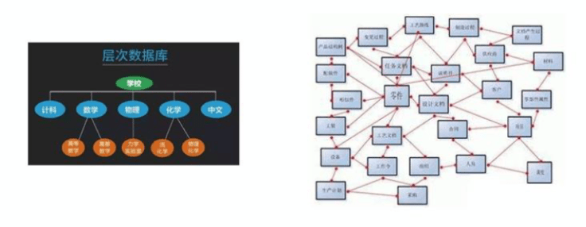
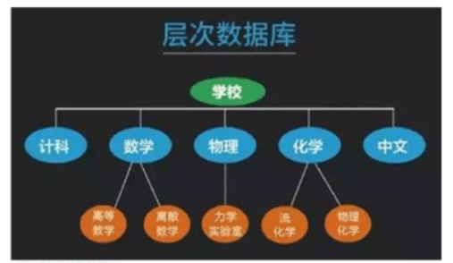
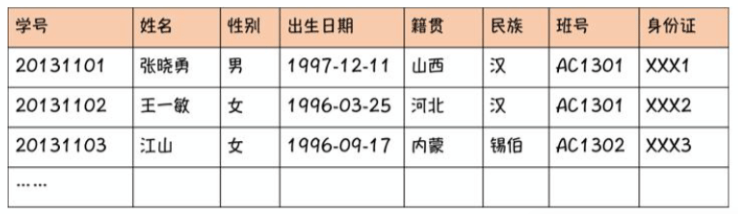
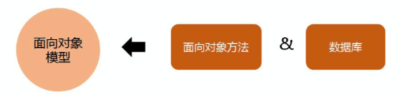
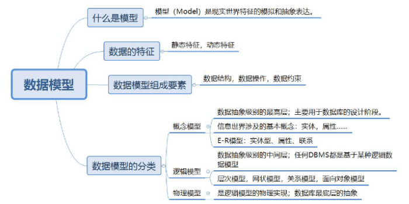

# 数据库系统概述
数据库技术是对数据进行管理的技术。

## 数据库基本概念
**数据、数据库、数据库管理系统、数据库系统** 是数据库中最常用的四个基本概念。
### 什么是数据(识记)
数据(Data)是描述事物的**符号记录**，是指利用物理符号记录下来的，可以鉴别的信息。

分三点：描述一个事物的记录，利用物理符号记录，且比较好鉴别。

来看一组数据：张三、男、26、北京、上海、13912345678

数据是信息存在的方式，比如上面的北京、上海两个位置。必须对数据进行解释处理才会有意义。如果不说明一个是出生地，一个是工作地，你不知道他是做什么的。**我们把对数据的解释处理称为数据的语义**。

### 什么是数据库(识记)
数据库(Database, DB) 是指**长期存储**在计算机中**有组织**的、**可共享**的数据集合。

- 长期存储，当数据比较多时，现在用不到，但以后的某个时间可能会用到。数据不能被扔掉，就需要把数据存到数据库，长期存储。
- 有组织，当数据比较多且种类不同时，不可能随意存放，需要是有组织的。
- 可共享，存到数据库的数据，不只某一个人可以访问，其他人也可以访问，是共享的。

数据要按照一定的**数据模型(创建数据库的人给的一种规则)组织、描述和存储**，具有较小的**冗余度(重复的，多余的)**、较高的**数据独立性(比如：张三、男、26，这三个信息是对张三的描述，我们把'男'删掉，对张三26岁这两个信息没有影响)**，系统**易于扩展**，并可以被多个用户**分享**。

数据的三个基本特点：**永久存储、有组织、可共享** （注意数据库定义时是长期存储，数据的特点是永久存储）

### 数据库管理系统(识记)
数据库管理系统(DBMS)是专门用于**建立**和**管理**数据库的一套软件，介于**应用程序**和**操作系统**之间。

数据库管理系统的功能：
1. 数据定义功能(定义数据，有了数据才能进行操作)
2. 数据操纵功能(数据的增删改查)
3. 数据库的运行管理功能
4. 数据库的建立和维护功能
5. 数据组织、存储和管理功能
6. 其他功能(数据共享、网络通信功能、数据传输访问)

### 数据库系统的构成(识记)
数据库系统(DBS)构成如下图，一些情况把数据库也叫数据库系统

### 练习题
通常，一个完整的数据库系统包括数据库、数据库管理系统及相关实用工具、( ______ )、互数据库管理员和用户。 (填空题) 答案为：应用程序

数据库系统构成里面的简称：
- DB 数据库
- DBMS 数据库管理系统
- DBS 数据库系统
- DBA(Database administrator) 数据库管理员

## 数据管理技术的发展
数据库管理技术的发展
### 人工管理阶段(识记)
人工管理阶段的特点：
- 数据不保存
- 应用程序管理数据
- 数据面向应用程序
### 文件系统阶段(识记)
应用程序1 应用程序2 应用程序n ...

文件系统

数据1 数据2 数据n ...

### 数据库系统阶段(领会)
数据库系统的特点：
1. **数据集成( 主要目的 )**
2. 数据共享性高
3. 数据冗余小
4. 数据一致性(如果多人操作数据库，一方改了，另一方获取的数据也需要是改动过的)
5. 数据独立性高(数据定义与使用数据的应用程序分离称为数据独立)
6. 实施统一管理与控制(**主要包括：数据的安全性、完整性、并发控制与故障恢复等，即数据保护**)
7. 减少应用程序开发与维护的工作量

### 练习题
1.下面描述中，不属于数据库系统特点的是( )。单选题，答案: B

- A 数据独立性高
- B 数据冗余性高
- C 数据共享性好
- D 数据一致性好

2.数据的（  ）是数据库管理系统的主要目的。填空题，答案：集成

3.数据定义与使用数据的应用程序分离称为(  )。 填空题，答案：数据独立

4.数据库管理系统具有对数据的统一管理和控制功能，主要包括数据的独立性、完整性、并发控制与（   ）等，即数据保护。 填空题，答案：故障恢复

## 数据库系统的结构
### 数据库系统的结构分类(识记)
- 从DBA的视角，分为内部系统结构、外部系统结构
  - 内部系统结构，采用**三级模式：模式、内模式、外模式**
  - 外部系统结构，分为：
    - 集中式结构(一台或多台计算机组成的中心节点，将数据集中在中心节点处理)
    - 分布式结构(分在不同的计算机上处理)
    - 并行结构(同时操作许多数据项)
- 从数据库应用和用户的视角，分为：
  - **客户/服务器结构(CS)**
  - **浏览器/服务器结构(BS)**

### 数据库系统的三级模式结构(领会、重要)

#### 模式
也称为**概念模式**或**逻辑模式**，是数据在逻辑上的视图，即**概念视图** (视图：数据在用户面前的展现)。

**模式是数据库的核心，也是数据库设计的关键。**

#### 外模式
也称为**子模式**或**用户模式**, **数据视图，即用户视图**，不同的应用程序会对应不同的外模式(用户视图)，外模式可以有多种，一个外模式可以对应一个或多个应用

**外模式作用：简化数据库接口，方便使用**

#### 内模式
物理级别（现实存在的）的对应的都是内模式，也称为**存储模式**，是**内部视图**或**存储视图**

外模式对应的是用户(应用程序)
模式对应的是概念、逻辑、组织这些东西
内模式对应的是物理级别的东西，如存储

名称 | 别称 | 视图类型
--- | --- | ---
模式 | （ ）模式，（ ）模式 | （ ）视图
外模式 | （ ）模式，或（ ）模式 | （ ）视图，即 （ ）视图
内模式 | （ ）模式 | （ ）视图 或 （ ）视图

#### 练习题
1.在数据库系统中，描述全部数据的整体逻辑结构的是(  )。单选器，答案：B
- A 外模式
- B 概念模式
- C 内模式
- D 存储模式

2.从数据库管理员的视角看，数据库外部体系结构通常表现为集中式结构、分布式结构、（  ）。填空题，答案：并行结构

3.外模式也称为子模式或（  ）。单选题，答案：B
- A 逻辑模式
- B 用户模式
- C 存储模式
- D 概念模式

### 三级模式结构的两层映像(领会)
所谓**映像**，就是一种**对应规则**，它指出映象双方是如何进行转换的。

**外模式/模式映象**，外模式和模式之间的映象。保证了数据与程序的**逻辑独立性**。
**内模式/模式映象**，内模式和模式之间的映象。保证了数据与程序的**物理独立性**

练习题：

所谓映象，就是一种（  ），它指出映象双方是如何进行转换的。填空，答案：对应规则

### 客户/服务器结构(识记)
客户/服务器结构(Client/Server, C/S)中, "客户端"、"前台" 或 "表示层" **主要完成与数据库使用者的交互任务**；"服务器"、"后台"或"数据层" **主要负责数据管理**。

单机方式：数据层和表示层在一个机器上。
网络方式：数据层和表示层分布在一个网络的不同机器上。把数据放在网络里的一个机器上，通过网络里的另一个机器去访问这个数据。

### 浏览器/服务器结构(识记)
浏览器/服务器结构(Browser/Server, B/S)，是一种基于web应用的客户/服务器结构，也称为**三层**客户/服务器结构。

三层：表示层、处理层（中间层）、数据层

## 数据模型(重要)
### 什么是模型(领会)
**模型（Model）**是现实世界特征的模拟和抽象表达。**数据模型**是对现实世界数据特征的抽象，描述的是数据的**共性内容**。

### 数据的特征(领会)
- 静态特征，分三种：
  - 数据的基本结构
  - 数据间的联系
  - 数据取值范围的约束
- 动态特征，指对数据可以进行符合一定规则的操作。

### 数据模型的组成要素(领会)
- 数据结构，描述的是系统的**静态特征**，即数据对象的**数据类型、内容、属性**以及数据对象之间的**联系**。
  - 层级模型、网状模型、关系模型(二维表格)模型
- 数据操作，描述的是系统的**动态特征**，操作分为: 更新(增、删除、改)、检索(查)
- 数据约束，描述的是数据结构中数据间的语法和语义关联

### 数据模型的分类(领会)
数据模型分为：概念模型、逻辑模型、物理模型

### 什么是概念层数据模型(领会)
**概念层**是数据抽象级别的**最高层**。概念层数据模型，也称为数据的**概念模型**或**信息模型**，这类模型主要用于数据库的**设计阶段**。

### 信息世界涉及的基本概念(领会)
- **实体(Entity)**，如学生、商品、课程等，**长方形**
- **属性(Attribute)**，实体所具有的一些特性，**椭圆形**
- **码或键(key)**，也是一个属性，是唯一标识某个实体的属性。
- **域(Domain)**，区域，范围，属性的取值范围
- **实体型(Entity Type)**，有些实体具有相同的属性，比如张三和李四都是26岁，那么年龄就是他们相同的属性。**用实体的名字和属性名字的集合**，来抽象和刻画共同的实体类型，我们称之为实体型。
- **实体集(Entity Set)** 张三和李四，在年龄上是相同的实体。相同实体的集合，称之为实体集。
- **联系(Relationship)**，实体之间的关系，**菱形**

数据模型中有 **"型"（type）** 和 **"值"（value）**  两个概念

型：姓名，性别，年龄，籍贯，所在城市，联系电话

值：张三，男，26，北京，上海，13912345678

### 概念模型的表示方法-ER图(领会)
概念模型的表示方法为ER图，实体关系图，见上面的图片-ER图示例

### 什么是逻辑层数据模型(领会)
**逻辑层**是数据抽象级别的**中间层**。逻辑层数据模型也称为数据的**逻辑模型**。任何DBMS都是基于某种**逻辑数据模型**。

### 练习题
1.数据结构描述的是系统的（  ）特性，即数据对象的数据类型、内容、属性以及数据对象之间的联系。填空题，答案：静态

2.（  ）描述的是系统的动态特性，是对各种对象的实例允许执行的操作的集合。单选题，答案：C
- A 数据模型
- B 数据结构
- C 数据操作
- D 数据约束

3.在设计数据库时，通常用（  ）来抽象，表示现实世界的各种事物及其联系。填空题，答案：概念模型

4.简述信息世界涉及哪些基本概念。简答题
实体、属性、码或键、域、实体型、实体集、联系

5.数据模型中有 "型" 和 （  ）两个不同的概念。填空题，答案：值

6.简述E-R模型的表示方法。简答题

1) 实体，用矩形表示，矩形框内写明实体的名称；
2）属性，用椭圆形表示，并用无向边将其与对应的实体连接起来；
3）联系，用菱形表示，菱形框内写明联系的名称，并用无向边分别与有关实体连接起来，同时在无向边旁标上联系的类型(1:1、1:N或M:N), 如果一个联系具有属性，则这些属性也用无向边与该联系连接起来

### 逻辑模型的类型(领会)
- 层次模型
  - 是最早使用的一种数据模型
  - 有且仅有一个节点没有父节点，称为**根节点**
  - 其他节点有且仅有一个父节点

  

- 网状模型
  - 以网状结构表示实体与实体间的联系
  - 允许结点有多个父结点
  - 可以没有父节点

  

- 关系模型
  - 用**二维表结构**来表示实体间的联系
  - 优点：建立在严格的数学概念的基础上；概念单一；存取路径对用户透明，有更高的数据独立性，更好的安全性。
  

- 面向对象模型
  - 既是概念模型，又是逻辑模型
  - 表达能力丰富，对象可复用、维护方便
  

逻辑模型类型 | 对应特性
--- | ---
层次模型 | 最早使用的一种数据模型；有且仅有一个结点没有（ ），称作（ ）；其他节点有且仅有一个（ ）  
网状模型 | 以（ ）结构表示实体与实体间的联系；允许结点有多个父节点；可以有结点没有父节点
关系模型 | 用（ ）结构表示实体间的联系；优点：建立在严格的（ ）基础上；概念单一；存取路径对用户透明，有更高的数据独立性，更好的安全保密性。
（）模型 | 既是概念模型，又是逻辑模型；表达能力丰富，对象可复用、维护方便

### 什么是物理层数据模型(领会)
物理层数据模型，也称为数据的**物理模型**，描述数据在存储介质上的组织结构，是逻辑模型的物理实现。
- 是数据库**最底层**的抽象
- 设计目标是提高数据库性能和有效利用存储空间

数据模型分类 | 对应特性
--- | ---
概念模型 | 数据抽象级别的（ ）；主要用于数据库的（ ）
逻辑模型 | 数据抽象级别的（ ）；任何DBMS都是基于某种（）
物理模型 | 描述数据在存储介质上的组织结构，是（ ）的物理实现；是数据库（ ）的抽象；设计目标是提高数据库性能和有效利用存储空间。

### 小结

### 练习题
1.下面数据模型中，采用二维表格结构来表示实体与实体之间联系的模型是（ ）。单选题，答案：A
- A 关系模型
- B 网络模型
- C 网状模型
- D 层次模型

2.（ ）是数据库系统最早使用的一种数据模型。填空题，答案：层次模型

3.简诉面向对象数据模型的优点。简答题

面向对象数据模型用面向对象观点来描述现实世界实体的逻辑组织、对象间的联系。其表达能力丰富、具有对象可复用、维护方便等优点。

4.（ ）是数据库最底层的抽象，它确定数据的物理存储结构、数据存储路径以及调整、优化数据库的性能。填空题，答案：物理模型

5.简述概念模型、逻辑模型、物理模型之间的关系。简答题

三个不同的数据模型之间**既相互独立又存在关联**。从**现实世界到概念模型的转换**是由数据库设计人员完成的；**从概念模型到逻辑模型的转换**可以由数据库设计人员完成，也可以用数据库设计工具协助设计人员完成；从**逻辑模型到物理模型的转换**主要由数据库管理系统完成。