# 关系数据库

## 1.关系数据库概述
关系数据库的产生历史(识记)
- 1970年，IBM的E.F.Codd提出了关系模型，奠定了关系数据库的理论基础。
- 20世纪70年代末，关系方法理论研究和软件系统的研制取得了重大突破，
- 1981年，出现了笔记成熟的关系数据库管理技术，证实了**关系数据库的优点：高级的非过程语言接口、较好的数据独立性**
- 20世纪80年代后，**网状模型和层次模型与底层实现的结合紧密，关系模型具有坚实理论基础**，成为主流数据模型。

练习题：

20世纪80年代后，在商用数据库管理系统中，（ ）逐渐取代早期的网状模型和层次模型，成为主流数据模型。填空题，答案：关系模型。 

## 2.关系数据模型
### 2.1关系数据模型的组成要素(识记)
回忆一下，数据模型的主要要素包括:（ ）、（ ）、（ ）。答案：数据结构、数据操作、数据约束

**关系数据模型的组成要素：关系数据结构、关系操作集合，关系的完整性约束**

完整性约束：如果性别可以是男、女，但你不能不填，如果不填就不行，这就是完整性约束

### 2.2关系数据结构(简单应用)
#### 表 (Table)
表是一个二维的数据结构，由表名、列、若干行数据组成。

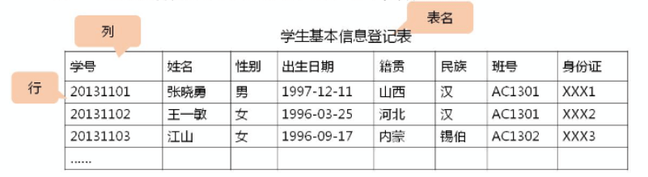

#### 关系 (Relation)
一个关系逻辑上对应一张二维表，可以为每个关系取一个名称进行表示。**表是关系的呈现，一定程度上，关系 = 表**。

关系的三种类型：
- 基本表，基本关系，基表，表示数据库实际存在的表
- 查询表，根据条件查询出来的新表
- 视图表，导出的需表，并不是数据库真实存在的表。比如将两个表的某些信息提取为一个新的可以展现的表，称为视图表

#### 列 (Column)
也称为字段（Field）或属性（Attribute）。列名、字段名、属性名。数据类型相同

#### 属性 (Attribute)
属性等同于列，属性的个数称为关系的元或度，8元(度)关系。列的值称为属性值，其取值范围称为值域（比如性别只能是男或女）

#### 行 (Row)
也称为**元组(Tuple)**或**记录(Record)**。表中的数据按行存储。表里面的一行，也称为一个元组

练习题：

表中的行，也称为（ ）或记录。填空题，答案：元组

#### 元组 (Tuple)
元组也称为行

#### 分量 (Component)
分量就是具体的数据项，学号这个字段，有一个值为 20131101 这个值就是一个分量。即元组中的一个属性值，称为分量

练习题：

元组中的一个属性值，称为（ ）。填空题，答案：分量

#### 码或键 (Key)
能够用来进行唯一标识的属性、字段。属性(或属性组)的值都能用来唯一标识该关系的元组，则称这些属性(或属性组)为该关系的码或键。比如学号、身份证号就是码或键，码或键可以有多个，比如一个属性组(学号 + 姓名)，也是码

#### 超码或超链 (Super Key)
在码(属性组)中去除某个属性，它仍然是这个关系的码，这个属性组就是超码

练习题：

如果在关系的一个码中移去某个属性，它仍然是这个关系的码，则称这样的码或键为该关系的（ ）。单选题，答案：A
- A 超码
- B 候选码
- C 主码
- D 全码

#### 候选码或候选键 (Candidate Key)
在码中不能从中移去任何一个属性，否则它就不再是这个关系的码或键。比如学号、身份证号都是候选码

#### 主属性(Primary Attribute)和非主属性(Nonprimary Attribute)
包含在任何一个候选码中的属性称为主属性或码属性。不在候选码中的属性，称为非主属性。

练习题：

1.在关系的一个码或键中，不能从中移去任何一个属性，否则它就不是这个关系的码或键，称这样的码或键为该关系的（ ）。填空题，答案：候选码或候选键

2.一个关系的候选码或候选键是这个关系的（  ）超码或超键。填空题，答案：最小

3.在数据库中，关系中包含在任何一个候选码中的属性称为（  ）。填空题，答案：主属性或码属性

#### 主码或主键 (Primary Key)
在若干个候选码中**指定**一个唯一标识关系的元组（行）。主码或主键是候选码中的一个特殊情况，只能有一个。是我们主观意愿指定的，比如学号、身份证号都可以是主码，看我们指定谁是主码

#### 全码或全键 (All-Key)
一个关系模式的所有属性集合是这个关系的主码或主键，这样的主码或主键称为全码或全键。全码或全键是一个特殊的主键。

#### 外码或外键 (Foreign Key)
某个属性（或属性组）不是这个关系的主码或候选码，而是另一个关系的主码。

#### 参照关系(Referencing Ralation)与被参照关系(Referenced Relation)
参照关系也称为从关系，被参照关系也称为主关系，他们是指以外码相关联的两个关系 

练习题：

1.当关系有多个候选码时，选定一个作为主键，若主键为全码，应包含（  ）。单选题，答案：D
- A 单个属性
- B 两个属性
- C 多个属性
- D 全部属性

2.当关系中的某个属性（或属性组）不是这个关系的主码或候选码，而是另一个关系的主码时，称该属性（或属性组）为这个关系的（  ）。单选，答案：B
- A 超码
- B 外码
- C 半码
- D 全码

3.在关系数据结构中，参照关系也称为（  ）。填空题，答案：从关系

#### 知识点回顾

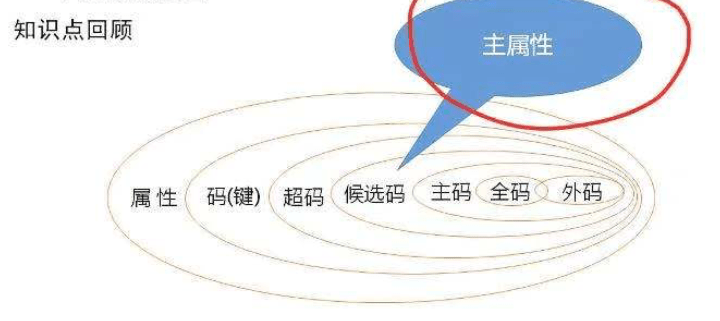

#### 域 (Domain)
域就是一个范围，表示属性的取值范围。

练习题：

在关系数据结构中，（ ）表示属性的取值范围。填空题，答案：域。

#### 数据类型 (Data Type)
每个列都有相应的数据类型，它用于限制（或容许）该列中存储的数据。比如varchar类型，日期类型等

#### 关系模式 (Relation Schema)
关系模式是对关系的描述和类型的概括。关系模式是型(type)，关系是值(value)。关系模式是静态的，稳定的。关系是动态的，随时间不段变化的。

#### 关系数据库 (Relation Database)
所有关系的集合，构成一个关系数据库。

以关系模型作为数据的逻辑模型，并采用关系作为数据组织方式的一类数据库，其数据库操作建立在关系代数的基础上。

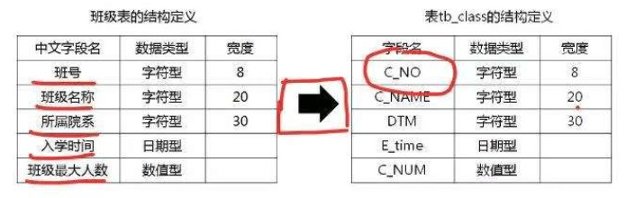

关系数据库对关系的限定/要求：
1. 每一个属性都是**不可**分解的（不允许表中有表）
2. 每一个关系仅仅有**一种**关系模式
3. 每一个关系模式中的属性必须命名，属性名**不同**
4. 同一个关系中，**不允许**出现候选码或候选键值完全相同的元组
5. 在关系中**元组**的顺序（即行序）是无关紧要的，可以任意交换。
6. 在关系中**属性**的顺序（即列序）是无关紧要的，可以任意交换。

#### 练习题
1.下面关系关系的描述中，不正确的说法是（  ）。单选题，答案：C
- A 在关系中，每一行数据是可以任意交换的
- B 在关系中，每一列数据是可以任意交换的
- C 在关系中，任意两行数据是不允许重复的
- D 在关系中，任意两个属性名是不允许重名的

2.设有课程关系Course(课程号，课程名，学分，专业号)和专业关系Speciality（专业号，专业名），则课程关系Course的外键是（）。单选题，答案：D
- A 课程号
- B 学分
- C 专业名
- D 专业号

3.关系数据库对关系的限定有哪些具体要求？ 简答题，3个每一个(属性、关系、关系模式)，1个同一个关系，2个可任意交换（行、列）

关系数据库对关系是有限定的，具体要求如下：
1. 每一个属性都是不可分解的
2. 每一个关系仅有一种关系模式
3. 每一个关系模式的属性必须命名，在同一个关系模式中，属性名必须是不同的。
4. 同一个关系中不允许出现候选码或候选键值完全相同的元组
5. 在关系中元组的顺序是无关紧要的，可以任意交换
6. 在关系中属性的顺序是无关紧要的，可以任意交换

### 2.3关系操作集合

#### 基本的关系操作(识记)
增删查改：检索（查），更新(增、修改、删除)

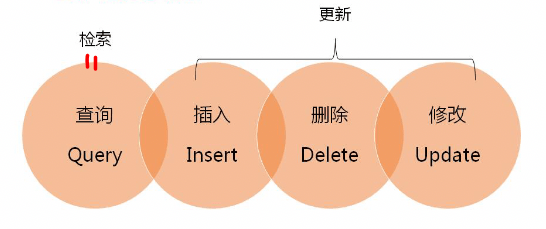

关系操作的特点：集合的操作方式（一次一集合）

#### 关系数据语言的分类(识记)
1. 关系代数语言
2. SQL（结构化查询语言）
3. 关系演算语言（元组关系演算；域关系演算）

这些语言的共同特点：具备完备的表达能力，是非过程化的集合操作语言，功能强，能够独立使用也可以嵌入高级语言中使用。

#### 关系代数的运算符(识记)
任何一种操作都包含三大要素:
- 操作对象
- 操作符
  - 集合运算符
  - 关系运算符
  - 比较操作符（辅助用）
  - 逻辑操作符（辅助用）
- 操作结果

#### 传统的集合运算(领会)
- 并 (UNION) U

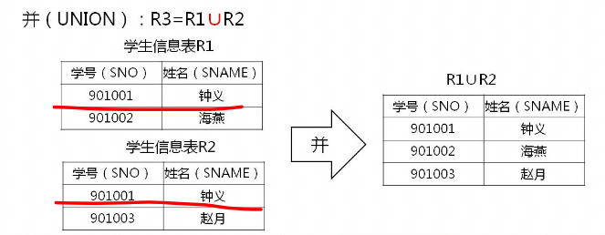

- 差 (DIFFERENCE) - 

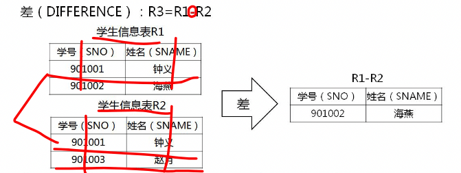

- 交 (INTERSECTION) ∩

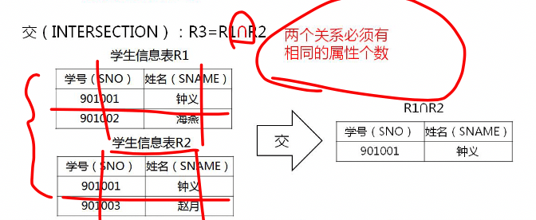

- 笛卡尔积 (CARTESIAN PRODUCT) x

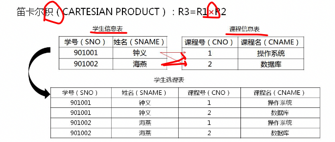

#### 练习
1.下列操作中，不属于关系操作的是（  ）。单选题，答案：C
- A 查询
- B 插入
- C 复制
- D 修改

2.下列不属于操作要素的是（  ）。单选题，答案：D
- A 操作对象
- B 操作符
- C 操作结果
- D 操作过程

3.运算符U的含义是 （  ）。单选题，答案：C
- A 差
- B 交
- C 并
- D 除

3.如下图，R-S的结果是（  ）。单选题，答案：B

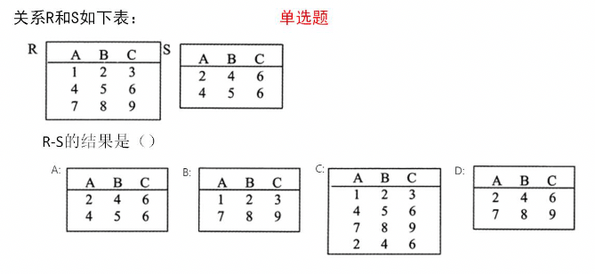

#### 专门的关系运算(领会)
先来认识几个字母：
- R 关系名，也就是表名。
- S 关系名，也是表名，一般有两个表时，表1用R表示，表2用S表示
- σ 希腊字母，西格玛小写，∑ 英语名称：Sigma 汉语名称：西格玛（大写Σ，小写σ）
- F 条件，由常数、属性或列名、比较操作符(>、<、=、>=、<=、≠)及逻辑操作符()组成的条件表达式。
- A 属性组，可以是单个，也可以是多个
- π 投影，选出某个表中的某些列数据
- θ theta， [ˈθiːtə]，希腊字母，连接条件，分为等值连接(=)和自然连接(其他)

##### 选择 (SELECT)
σF(R), SELECT 关系名 WHERE 条件，假设表名为s1。select s1 where 性别 = "男"，σgender="男"(S1)

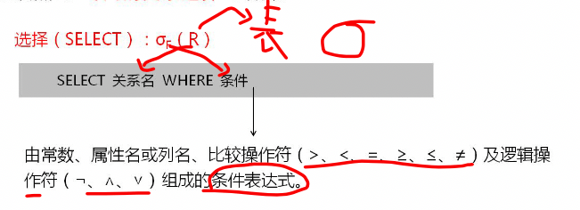

##### 投影 (PROJECTION)
πA(R) 选出来的列，projection 关系名 (属性名1，属性名2，...，属性名n)，假设表名为s1。π(SNO,SNAME)(S1)

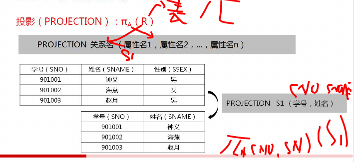

##### 连接 (JOIN)
连接(JOIN)，也称θ连接：R ⋈ S，，θ分为等值连接(=)和自然连接(其他)，JOIN 关系名1 AND 关系名2 WHERE 条件，等值连接就是先给两个关系做笛卡尔积，去掉R.B不等于S.B的情况。如果不是等值连接，还需要去掉重复的R.B和S.B，只保留一列

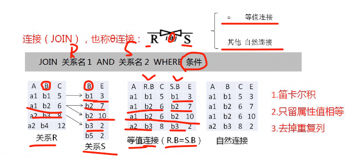

##### 除 (DIVISION)
除 (DIVISION)：R ÷ S，假设有关系R(A,B,C,D)与关系S(C,D)，R除S计算过程：先计算AB的投影 πAB(R)，再计算它和S的笛卡尔积 S x πAB(R)，最后将其结果与R相比较，完全相同记录，去除CD列及重复项就是除的结果。

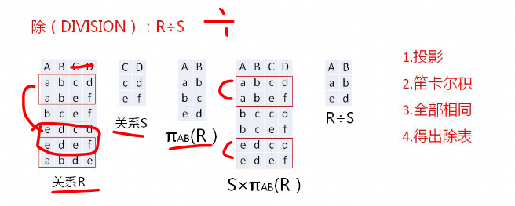

#### 练习
1.关系代数运算"投影"的运算符是（  ）。单选题，答案：B
- A σ
- B π
- C ∩
- D x

2.πA(R)中A指的是（ ）。单选题，答案：A
- A 属性序列
- B 条件表达式
- C 被运算关系名
- D 连接

3.关系代数中投影运算是对关系进行的（  ）。单选题，答案：A
- A 垂直分解
- B 水平分解
- C 结合
- D 先垂直分解后水平分解

4.如下图，有关系SC(SNO,CNO,AGE,SCORE)，查找年龄大于22岁的学生的学号和分数，正确的关系代数表达式是（）。单选，答案：A

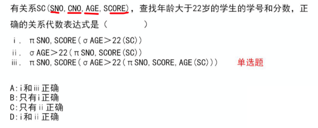

### 2.4关系的完整性约束(简单应用)
数据库的数据完整性是指数据库中数据的**正确性、相容性、一致性**。(大概率会考)，比如：在一个关系中，学生的学号必须是唯一的，性别必须是男女，不能是漂亮、美丽

数据库的数据完整性是指数据库中数据的（  ）、（  ）、（  ）。答案：正确性、相容性、一致性

#### 实体完整性约束 (Entity Integrity Constraint)
关系用来描述现实世界的实体集。**主码的组成不能为空，主属性不能是空值(NULL)**

#### 参照完整性约束 (Referential Integrity Constraint)
定义外码(外键)和主码(主键)之间的引用规则，要么外码等于主码中的某个元组的主码值，要么为空值(NULL)

关系的两个不变性：实体完整性约束、参照完整性约束

#### 用户定义完整性约束 (User-defined Integrity Constraint)
- 域完整性约束，针对某一应用环境的完整性约束，比如某个属性只能是教育类相关公司
- 其他

#### 执行插入操作的校验
先检查实体完整性约束（主键不能为空，且不能和已有的重复）；再检查参照完整性约束（如下图）；再检查用户定义完整性约束。

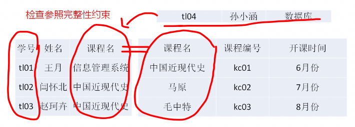

上图中，插入操作时，参照完整性约束校验失败，无法插入，因为参照关系里的外键值在被参照关系中的主键里找不到。如果非要插入进去，可以将外键的值设置为NULL

#### 执行删除操作的校验
一般只需要对被参照关系**检查参照完整性约束**，是否被其他表(关系)所引用

#### 执行更新操作的校验
上述两种情况的综合，先删除、再新增。

#### 练习
1.设有关系WORK(ENO,CNO,PAY)，主码为（ENO,CNO）。按照实体完整性规则（  ）。单选题，答案：D
- A 只有ENO不能取空值
- B 只有CNO不能取空值
- C 只有PAY不能取空值
- D ENO与CNO都不能取空值

2.如下图，单选题，答案：C

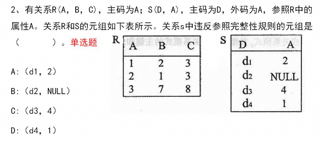

## 3.关系数据库的规范化理论(重难点)
关系模式中各属性之间的依赖关系及其对关系模式性能的影响

### 3.1关系模式中可能存在的冗余和异常问题(简单应用)
- 数据冗余，同一数据被反复存储的情况
- 更新异常，一般数据冗余造成的，比如将某人姓名、年龄存多条记录，但修改时只修改一条，就会存在更新异常
- 插入异常，比如插入时主码的值为空，就会插入异常
- 删除异常

练习题：

关系模式有"好"与"不好"之分，"不好"的关系模式可能存在的问题有：（ ）、更新异常、插入异常和删除异常。填空题，答案：数据冗余

### 3.2函数依赖与关键字(综合应用,可能有简答题)
知道了关系模式中可能存在的问题后，怎么对关系进行规范化呢？

数据依赖分为：函数依赖，多值依赖(涉及第4范式)

什么是函数？f: A → b, y = f(x)，对于一个规则，每一个A集合当中，都会有唯一一个B与值对应，记做 y = f(x)，这个就叫函数

> 设R为任一给定关系，如果**对于R中属性X的每一个值，R中的属性Y只有唯一值与之对应**，则称 X **函数决定** Y 或称 Y **函数依赖于** X，记作 X → Y。其中X称为决定因素。

学号(SNO) | 姓名(SNAME) | 性别(SSEX)
--- | --- | ---
901001 | 张三 | 男
901002 | 李四 | 女
901003 | 王五 | 男

上面的表中，学号是主键，学号可以确定一个人的姓名，也可以确定性别。即 SNO → SNAME; SNO → SSEX

> 对于关系R中的属性X和Y，若X不能决定函数Y，记作X /→ Y，X不能决定Y，即 SSEX /→ SNAME; SSEX /→ SNO

#### 函数依赖
函数依赖的分类：完全函数依赖、部分函数依赖、传递函数依赖

##### 完全函数依赖
设R为任一给定关系，X、Y为其属性集，若 **X → Y**，且对X中任何真子集X’，都有 **X‘ /→ Y**，则称**Y完全函数依赖于X**。(可能会考简答题)

SC（SNO,CNO,CTITLE,INAME,IPLACE,GRADE）

(学号，课程号，课程名，授课老师，授课地址，成绩)

(SNO,CNO) → GRADE, 学号和课程号可以决定成绩，而学号或课程单独一个是无法决定成绩的，那么GRADE完全函数依赖于(SNO,CNO)，(SNO,CNO) → GRADE为完全函数依赖

##### 部分函数依赖
设R为任一给定关系，X、Y为其属性集，若 **X → Y**，且对X中存在一个真子集X’，满足 **X' → Y**，则称**Y部分函数依赖于X**。

学号(SNO) | 姓名(SNAME) | 性别(SSEX)
--- | --- | ---
901001 | 张三 | 男
901002 | 李四 | 女
901003 | 王五 | 男

上面的表中，(SNO,SNAME) → SSEX，部分函数依赖

##### 传递函数依赖
设R为任一给定关系，**X,Y,Z** 为其不同属性子集，若**X → Y**， **Y /→ X**, **Y → Z**，则有 **X → Z**，称为**Z传递函数依赖于X**。

BOOKS（BNO，PNAME，PADDRESS）

（书号，出版社名，出版社地址）

BNO → PNAME, PNAME /→ BNO, PNAME → PADDRESS，即BNO → PADDRESS，则PADDRESS传递函数依赖于BNO

#### 关键字
关键字的定义

> 设R为任一给定关系，U为其所含的全部属性集合，X为U的子集，若有完全函数依赖X → U，则X为R的一个候选关键字。

SC（SNO,CNO,CTITLE,INAME,IPLACE,GRADE）

(SNO,CNO) → CTITLE，(SNO,CNO) → INAME，(SNO,CNO) → IPLACE，(SNO,CNO) → GRADE，则 (SNO,CNO)为候选关键字，类似于候选码

#### 练习题
函数依赖根据不同性质可分为：完全函数依赖，部分函数依赖和（  ）。填空题，答案：传递函数依赖

### 3.3范式与关系规范化过程(综合应用)
一个低一级的范式的关系模式通过**模式分解(Schema Decomposition)**可以转换为若干个**高一级范式**的关系模式的集合，这种过程就叫做**规范化(Normalization)**。

第一范式1NF => 第二范式2NF => 第三范式3NF

#### 第一范式
设R为任一给定关系，若R中的每个**列与行的交点处**的取值是**不可**再分的基本元素，则R为第一范式。

满足第一范式的表SC

SNO | CNO | CTITLE | INAME | IPLACE | GRADE
--- | --- | --- | --- | --- | ---
901001 | C01 | 操作系统 | 王中 | 东01 | 70
901002 | C01 | 操作系统 | 王中 | 东01 | 70
901002 | C02 | 数据库 | 高围 | 东02 | 85

第一范式1NF 冗余高，可能会造成插入操作异常。删除操作异常

#### 第二范式
设R为任一给定关系，若R为**1NF**，且其所有非主属性都**完全函数**依赖于**候选关键字**，则R为第二范式

上面的表格中，候选码(候选关键字)为 (SNO,CNO)，非主属性为CTITLE, INAME, IPLACE, GRADE，GRADE 完全函数依赖 (SNO,CNO)。但CTITLE，INAME,IPLACE都不完全函数依赖(SNO,CNO)，所以他是非第二范式，那就调整下，把非完全依赖的属性拿出来再组成一个表，拆成两个表，则为第二范式了。

SNO | CNO | GRADE
--- | --- | --- 
901001 | C01  | 70
901002 | C01 | 70
901002 | C02 | 85

CNO | CTITLE | INAME | IPLACE
--- | --- | --- | --- 
C01 | 操作系统 | 王中 | 东01
C02 | 数据库 | 高围 | 东02 

#### 第三范式
设R为任一给定关系，若R为**2NF**，且其每一个非主属性都**不传递函数依赖**于**候选关键字**，则R为第三范式。

上面的例子中，课程号CNO → CTITLE, CTITLE → INAME, CTITLE → IPLACE 这里 INAME和IPLACE都传递函数依赖CNO，所以把INAME和IPLACE提取出来，用一个外键关联

CNO | CTITLE | INAME
--- | --- | --- 
C01 | 操作系统 | 王中 
C02 | 数据库 | 高围 

INAME | IPLACE
--- | --- 
王中 | 东01
高围 | 东02

来看一个第三范式的例子，下面的表格虽然是第三范式，但感觉还是不怎么好

SNO | CTITLE | INAME
--- | --- | --- 
s01 | 操作系统 | 王月
s01 | C++ | 韩雨
s02 | 数据库 | 孙小涵
s03 | 操作系统 | 王五
s04 | 操作系统 | 王月

#### 第三范式的改进形式(BCNF)
设R为任一给定关系，X，Y为其属性值，F为其**函数依赖集**，若R为**3NF**，且其F中所有函数依赖X → Y(Y不属于X)中的X必须包括**候选关键字**，则R为**BCNF（BC范式）**

上面第三范式的表中，函数依赖集为：INAME → CTITLE；(SNO,CTITLE) → INAME；(SNO,INAME) → CTITLE；属性集F中 INAME → CTITLE,INAME并不是候选关键字，所以不是BCNF，再拆分

SNO |  INAME
--- | --- 
s01 | 王月
s01 | 韩雨
s02 | 孙小涵
s03 | 王五
s04 | 王月

INAME | CTITLE
--- | ---
王月 | 操作系统
韩雨 | C++
孙小涵 | 数据库
王五 |  操作系统

#### 练习题
1.关系模式中满足2NF的模式（ ）。单选题，答案 B
- A 可能是 1NF
- B 必定是 1NF
- C 必定是 3NF
- D 必定是 BCNF

2.导致存在空间的浪费以及潜在数据不一致性何修改麻烦等问题出现的原因是（   ）。填空题，答案：数据冗余

3.下面说法正确的是（  ）。单选题，答案：C
- A 满足4范式不一定满足BCNF范式
- B 满足BCNF范式不一定满足4范式
- C 满足4范式一定满足BCNF范式
- D BCNF范式与4范式没有任何关系 

4."不好"的关系模式可能存在的问题不包括（  ）。单选题，答案：C
- A 数据冗余
- B 插入异常
- C 更新慢
- D 删除异常

5.简述关系规范化的过程。简答题

一个低一级范式的关系模式通过模式分解可以转换为若干个高一级范式的关系模式的集合，这种过程就叫做关系的规范化。
