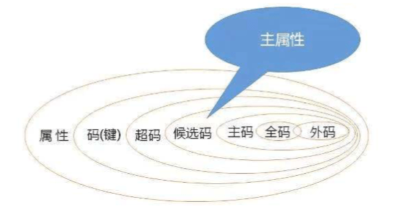

# 关系数据库

## 关系数据库概述
关系数据库的产生历史(识记)
- 1970年，IBM的E.F.Codd提出了关系模型，奠定了关系数据库的理论基础。
- 20世纪70年代末，关系方法理论研究和软件系统的研制取得了重大突破，
- 1981年，出现了笔记成熟的关系数据库管理技术，证实了**关系数据库的优点：高级的非过程语言接口、较好的数据独立性**
- 20世纪80年代后，**网状模型和层次模型与底层实现的结合紧密，关系模型具有坚实理论基础**，成为主流数据模型。

练习题：

20世纪80年代后，在商用数据库管理系统中，（ ）逐渐取代早期的网状模型和层次模型，成为主流数据模型。填空题，答案：关系模型。 

## 关系数据模型
### 关系数据模型的组成要素(识记)
回忆一下，数据模型的主要要素包括:（ ）、（ ）、（ ）。答案：数据结构、数据操作、数据约束

**关系数据模型的组成要素：关系数据结构、关系操作集合，关系的完整性约束**

完整性约束：如果性别可以是男、女，但你不能不填，如果不填就不行，这就是完整性约束

### 关系数据结构(简单应用)
#### 表 (Table)
表是一个二维的数据结构，由表名、列、若干行数据组成。

#### 关系 (Relation)
一个关系逻辑上对应一张二维表，可以为每个关系取一个名称进行表示。**表是关系的呈现，一定程度上，关系 = 表**。

关系的三种类型：
- 基本表，基本关系，基表，表示数据库实际存在的表
- 查询表，根据条件查询出来的新表
- 视图表，导出的需表，并不是数据库真实存在的表。比如将两个表的某些信息提取为一个新的可以展现的表，称为视图表

#### 列 (Column)
也称为字段（Field）或属性（Attribute）。列名、字段名、属性名。数据类型相同

#### 属性 (Attribute)
属性等同于列，属性的个数称为关系的元或度，8元(度)关系。列的值称为属性值，其取值范围称为值域（比如性别只能是男或女）

#### 行 (Row)
也称为**元组(Tuple)**或**记录(Record)**。表中的数据按行存储。表里面的一行，也称为一个元组

练习题：

表中的行，也称为（ ）或记录。填空题，答案：元组

#### 元组 (Tuple)
元组也称为行

#### 分量 (Component)
分量就是具体的数据项，学号这个字段，有一个值为 20131101 这个值就是一个分量。即元组中的一个属性值，称为分量

练习题：

元组中的一个属性值，称为（ ）。填空题，答案：分量

#### 码或键 (Key)
能够用来进行唯一标识的属性、字段。属性(或属性组)的值都能用来唯一标识该关系的元组，则称这些属性(或属性组)为该关系的码或键。比如学号、身份证号就是码或键，码或键可以有多个，比如一个属性组(学号 + 姓名)，也是码

#### 超码或超链 (Super Key)
在码(属性组)中去除某个属性，它仍然是这个关系的码，这个属性组就是超码

练习题：

如果在关系的一个码中移去某个属性，它仍然是这个关系的码，则称这样的码或键为该关系的（ ）。单选题，答案：A
- A 超码
- B 候选码
- C 主码
- D 全码

#### 候选码或候选键 (Candidate Key)
在码中不能从中移去任何一个属性，否则它就不再是这个关系的码或键。比如学号、身份证号都是候选码

#### 主属性(Primary Attribute)和非主属性(Nonprimary Attribute)
包含在任何一个候选码中的属性称为主属性或码属性。不在候选码中的属性，称为非主属性。

练习题：

1.在关系的一个码或键中，不能从中移去任何一个属性，否则它就不是这个关系的码或键，称这样的码或键为该关系的（ ）。填空题，答案：候选码或候选键

2.一个关系的候选码或候选键是这个关系的（  ）超码或超键。填空题，答案：最小

3.在数据库中，关系中包含在任何一个候选码中的属性称为（  ）。填空题，答案：主属性或码属性

#### 主码或主键 (Primary Key)
在若干个候选码中**指定**一个唯一标识关系的元组（行）。主码或主键是候选码中的一个特殊情况，只能有一个。是我们主观意愿指定的，比如学号、身份证号都可以是主码，看我们指定谁是主码

#### 全码或全键 (All-Key)
一个关系模式的所有属性集合是这个关系的主码或主键，这样的主码或主键称为全码或全键。全码或全键是一个特殊的主键。

#### 外码或外键 (Foreign Key)
某个属性（或属性组）不是这个关系的主码或候选码，而是另一个关系的主码。

#### 参照关系(Referencing Ralation)与被参照关系(Referenced Relation)
参照关系也称为从关系，被参照关系也称为主关系，他们是指以外码相关联的两个关系 

练习题：

1.当关系有多个候选码时，选定一个作为主键，若主键为全码，应包含（  ）。单选题，答案：D
- A 单个属性
- B 两个属性
- C 多个属性
- D 全部属性

2.当关系中的某个属性（或属性组）不是这个关系的主码或候选码，而是另一个关系的主码时，称该属性（或属性组）为这个关系的（  ）。单选，答案：B
- A 超码
- B 外码
- C 半码
- D 全码

3.在关系数据结构中，参照关系也称为（  ）。填空题，答案：从关系

#### 知识点回顾

#### 域 (Domain)
域就是一个范围，表示属性的取值范围。

练习题：

在关系数据结构中，（ ）表示属性的取值范围。填空题，答案：域。

#### 数据类型 (Data Type)
每个列都有相应的数据类型，它用于限制（或容许）该列中存储的数据。比如varchar类型，日期类型等

#### 关系模式 (Relation Schema)
关系模式是对关系的描述和类型的概括。关系模式是型(type)，关系是值(value)。关系模式是静态的，稳定的。关系是动态的，随时间不段变化的。

#### 关系数据库 (Relation Database)
所有关系的集合，构成一个关系数据库。

以关系模型作为数据的逻辑模型，并采用关系作为数据组织方式的一类数据库，其数据库操作建立在关系代数的基础上。

关系数据库对关系的限定/要求：
1. 每一个属性都是**不可**分解的（不允许表中有表）
2. 每一个关系仅仅有**一种**关系模式
3. 每一个关系模式中的属性必须命名，属性名**不同**
4. 同一个关系中，**不允许**出现候选码或候选键值完全相同的元组
5. 在关系中**元组**的顺序（即行序）是无关紧要的，可以任意交换。
6. 在关系中**属性**的顺序（即列序）是无关紧要的，可以任意交换。

#### 练习题
1.下面关系关系的描述中，不正确的说法是（  ）。单选题，答案：C
- A 在关系中，每一行数据是可以任意交换的
- B 在关系中，每一列数据是可以任意交换的
- C 在关系中，任意两行数据是不允许重复的
- D 在关系中，任意两个属性名是不允许重名的

2.设有课程关系Course(课程号，课程名，学分，专业号)和专业关系Speciality（专业号，专业名），则课程关系Course的外键是（）。单选题，答案：D
- A 课程号
- B 学分
- C 专业名
- D 专业号

3.关系数据库对关系的限定有哪些具体要求？ 简答题，3个每一个(属性、关系、关系模式)，1个同一个关系，2个可任意交换（行、列）

关系数据库对关系是有限定的，具体要求如下：
1. 每一个属性都是不可分解的
2. 每一个关系仅有一种关系模式
3. 每一个关系模式的属性必须命名，在同一个关系模式中，属性名必须是不同的。
4. 同一个关系中不允许出现候选码或候选键值完全相同的元组
5. 在关系中元组的顺序是无关紧要的，可以任意交换
6. 在关系中属性的顺序是无关紧要的，可以任意交换

### 关系操作集合
#### 基本的关系操作
#### 关系数据语言的分类
#### 关系代数
##### 传统的集合运算
- 并 (UNION)
- 差 (DIFFERENCE)
- 交 (INTERSECTION)
- 笛卡尔积 (CARTESIAN PRODUCT)
##### 专门的关系运算
- 选择 (SELECT)
- 投影 (PROJECTION)
- 连接 (JOIN)
- 除 (DIVISION)

### 关系的完整性约束
#### 实体完整性约束 (Entity Integrity Constraint)
#### 参照完整性约束 (Referential Integrity Constraint)
#### 用户定义完整性约束 (User-defined Integrity Constraint)
#### 关系模型完整性约束的检验
- 执行插入操作
- 执行删除操作
- 执行更新操作

## 3.关系数据库的规范化理论(重难点)
### 关系模式中可能存在的冗余和异常问题
- 数据冗余
- 更新异常
- 掺入异常
- 删除异常
### 函数依赖与关键字
- 完全函数依赖
- 部分函数依赖
- 传递函数依赖
### 范式与关系规范化过程
- 第一范式
- 第二范式
- 第三范式
- BCNF

### 关系规范化理论的应用
