# 数据库设计

## 1.数据库设计概述(识记)
### 数据库的生命周期
1. 数据库分析与设计阶段：需求分析、概念设计、逻辑设计、物理设计
2. 数据库实现与操作阶段：实现、操作与监督、修改与调整

### 数据库设计的目标
1. 满足应用功能需求：增删查改
2. 良好的数据库性能：共享性、完整性、一致性、安全保密性

### 数据库设计的内容
- 数据库结构设计(静态的)
  - 概念结构设计
  - 逻辑结构设计
  - 物理结构设计
- 数据库行为设计(动态的)，行为即操作
  - 功能设计
  - 事务设计
  - 程序设计

### 数据库设计的方法
- 直观设计法，最原始的数据库设计方法
- 规范设计法
  - 新奥尔良设计方法：需求分析、概念结构设计、逻辑结构设计、物理结构设计
  - 基于E-R模型的数据库设计方法
  - 基于第三范式的设计方法，是一类结构化设计方法
- 计算机辅助设计法

### 数据库设计的过程

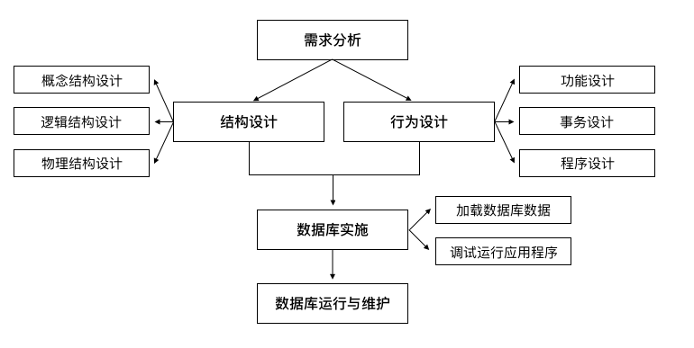

### 练习题
1.对于数据库的生命周期，属于数据库实现阶段的工作是（），单选题，答案：D
- A 需求分析
- B 概念设计
- C 逻辑设计
- D 数据库的修改与调整

2.数据库设计有两个十分重要的目标，即满足（  ） 和良好的数据库性能。填空题，答案：应用功能需求

3.数据库设计方法可分为三类，即（  ）设计法、规范设计法、计算机辅助设计法。填空题，答案：直观

4.数据库设计的第一个阶段是（  ）。单选题，答案：A
- A 需求分析
- B 结构设计
- C 行为设计
- D 数据库实施

## 2.数据设计的基本步骤(领会)

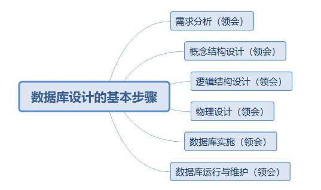

### 需求分析(简单题)
目标：是了解与分析用户的信息及应用处理的要求，并将结果按一定格式整理而形成的**需求分析报告**

该分析报告是后续**概念设计**、**逻辑设计**、**物理设计**、数据库**建立**与**维护**的依据。

需求分析内容：
- 确定数据范围
- 分析数据应用过程
- 收集与分析数据
- 编写需求分析报告

#### 确定数据库范围
确定数据库范围 --- **支持哪些应用功能**。
- 有效利用计算机设备及数据系统的潜在能力。
- 提高数据库的应变能力
- 避免应用过程中对数据库做太多或太大的修改
- 延长数据库的生命周期

#### 应用过程分析
应用过程分析 --- **结果是数据库结构设计的重要依据**
- 用到哪些数据
- 数据使用的顺序
- 对数据做何处理和处理的策略以及结果

#### 收集与分析数据
##### 静态结构
- 数据分类表，用于数据的总体描述

数据ID | 数据名 | 用途 | 主人 | 用户 | 来源 | 去向 | 存档时间 | 数据量
--- | --- | --- | --- | --- | --- | --- | --- | ---
 | | | | | | | | 

- 数据元素表，指通常意义下的数据项或属性

数据ID | 数据元素ID | 元素名 | 意义 | 类型 | 长度 | 算法 | 备注
--- | --- | --- | --- | --- | --- | --- | --- 
 | | | | | | |

##### 动态结构
- 任务分类表，一个任务指为完成某一特定处理功能的相对独立的**操作序列**。

任务ID | 名称 | 功能 | 类型 | 主人 | 用户 | 执行日期 | 频率 | 操作过程 | 备注
--- | --- | --- | --- | --- | --- | --- | --- | --- | ---
 | | | | | | | | | 

- 数据操作特征表，用以描述**任务和数据**之间的关系，它包括不同任务对数据执行不同操作的频率

任务ID | 数据ID | 建立 | 查询 | 插入 | 修改 | 删除 | 数据量 
--- | --- | --- | --- | --- | --- | --- | --- 
 | | | | | | | 

##### 数据约束
- 数据的**安全保密性**
- 数据的**完整性**
- **响应时间**
- **数据恢复**

#### 编写需求分析报告
- 数据库的应用功能目标
- 标明不同用户的视图范围
- 应用处理过程需求说明，包括：数据流程图、任务分类表、数据操作特征表、操作过程说明书
- 数据字典，是数据库系统中存储三级结构定义的数据库，通常指的是数据库系统中各类数据详细描述的集合。通常包括数据分类表、数据元素表和各类原始资料。
- 数据量
- 数据约束

### 概念结构设计
- 概念模型（自顶向下）
- 独立于任何软件与硬件（**主要目标：最大限度的满足应用需求**）

### 逻辑结构设计
逻辑模型有哪些类型：层次模型、网状模型、关系模型、面向对象模型

- 逻辑结构设计的输入与输出信息
- 逻辑结构设计的步骤

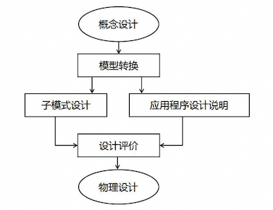

模型转换 => DBMS支持的关系模型、网状模型或层次模型

设计评价 => 检验模式及子模式(外模式)的正确性与合理性

### 物理设计
具体任务主要是：确定数据库在存储设备上的**存储结构**及**存取方法**。

因DBMS的不同还可能包括**建立索引**和**聚集**，以及**物理块大小**、**缓冲区个数和大小**、**数据压缩的选择**等。

### 数据库实施
- 加载数据：收集、分类、整理校验、输入等
- 应用程序设计：具有较高的稳定性，并具有试运行的数据基础，也具备了应用程序编制与调试的必要条件。这样编写的应用程序具有较高的稳定性和实用性
- 数据库试运行：有利于工作人员掌握并熟悉系统；有利于正式运行时避免人为的操作不当等损害。

### 数据库运行和维护
保证数据库的正常运行，系统维护中最困难的工作是数据库重组与重构

### 练习题
1.数据库物理设计完成后，进入（  ）阶段。填空题，答案：数据库实施

2.物理设计的具体任务主要是确定数据库在存储设备上的存储结构及（  ）。填空题，答案：存取方法

3.物理设计的内容因DBMS的不同还可能包括建立索引和（   ），以及物理块大小、数据压缩等。填空题，答案：聚集

4.下表是（  ）。单选题，答案：B

数据ID | 数据名 | 用途 | 主人 | 用户 | 来源 | 去向 | 存档时间 | 数据量
--- | --- | --- | --- | --- | --- | --- | --- | ---
 | | | | | | | | 

- A 数据元素表
- B 数据分类表
- C 任务分类表
- D 数据操作特征表

5.数据的（  ）是指不施加应用操作于其上时数据的原始状况，这可通过数据分类表和数据元素表进行说明。填空题，答案：静态结构

## 3.关系数据库设计方法

### 关系数据库设计过程与各级模式(识记)

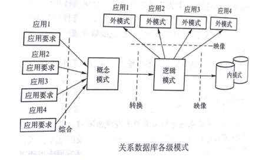

### 概念结构设计(综合应用)
#### E-R图的表示方法(重点)
实体：长方形(矩形)；属性：椭圆；菱形：联系

- 1 : 1 联系(一对一关系) 系 - 系主任

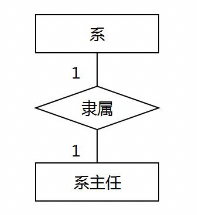

- 1 : N 联系(一对多关系) 班级 - 学生

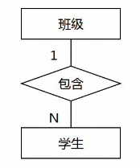

- M : N 联系(多对多关系) 学生 - 课程

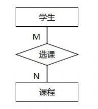

- 三个实体之间的一对多联系

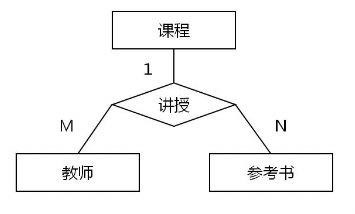

- 三个实体之间的多对多联系

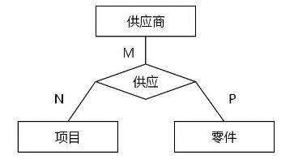

- 单个实体型内的一对多联系

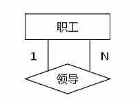

#### 局部信息结构设计
- 确定局部范围，主要依据**需求分析报告**中标明的**用户视图范围**来确定，往往与子模式范围相对应。
- 选择实体，**数据分类表**是选择实体的直接依据。实体选择的最大困难是如何区别**实体与属性**。
- 选择实体的关键字属性，实体的存在依赖于其**关键字**的存在。
- 确定实体间联系，数据间的联系必须在**概念设计**时确定。
- 确定实体的属性，属性分为**标识属性**(唯一存在的，实体的关键字)和**说明属性**(对实体的说明，描述的实体的一般特征)

局部信息结构设计 - 用户管理系统E-R图示例
1. 用户：用户ID、用户名、年龄、口令
2. 用户组：用户组ID、用户组名、用户组描述
3. 部门：部门ID、部门名、部门所在地、部门领导
4. 权限：权限ID、权限名、权限链接

用户组与用户是一对多联系，表示每个用户属于一个用户组、一个用户组有多个用户，其联系的名称定义为 "属于"

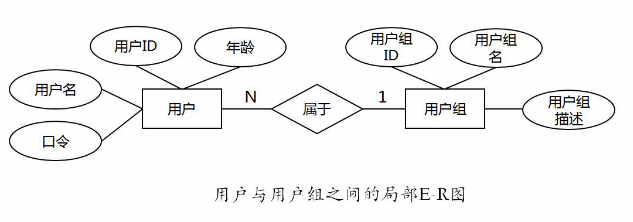

部门与用户是一对多联系，表示每个部门包含多个用户，每个用户只在一个部门，其名称定义为"包含"。

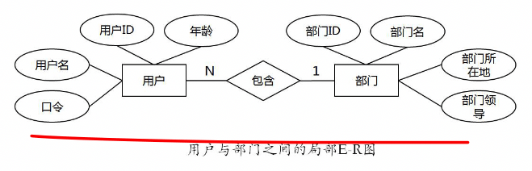

用户组和权限之间是多对多联系，表示一种权限可以分配给多个用户组，每个用户组可以拥有多种权限，其联系的名称定义为"拥有"

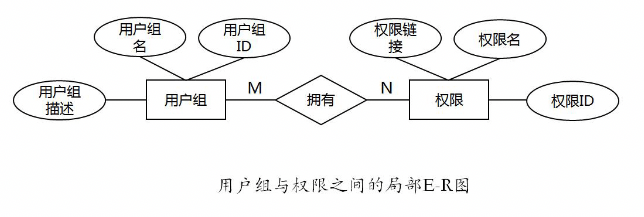

#### 全局信息结构设计
将局部信息设计组合在一起，就是全局信息结构

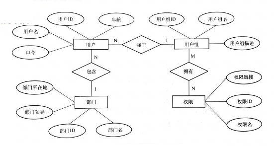

#### 练习题
1.对于实体集A中的每一个实体，实体集B中至少有一个实体与之联系，反之亦然，则称实体集A与实体集B之间具有的联系是（  ）。单选题，答案：C
- A 多对一
- B 一对多 
- C 多对多
- D 一对一

2.ER模型是数据库的设计工具之一，它一般适用于建立数据库的（  ）。单选题，答案：A
- A 概念模型
- B 逻辑模型
- C 内部模型
- D 外部模型

3.每个部门有多名职工，每名职工在一个部门任职，实体集部门与职工之间的联系是（  ），单选题，答案：B
- A 一对一
- B 一对多
- C 多对一
- D 多对多

4.为体育部门建立数据库，其中包含如下信息：

（1）运动队：队名、主教练、其中队名唯一标识运动队。

（2）运动员：运动员编号、姓名、性别、年龄

（3）运动项目：项目编号、项目名、所属类别

其中，每个运动队有多名运动员，每名运动员只属于一个运动队；每名运动员可以参加多个项目，每个项目可以有多个运动员参加。系统记录每名运动员参加每个项目所得名次和成绩以及比赛日期。

根据以上叙述，建立ER模型，要求标注联系类型。（实体的属性可以省略）

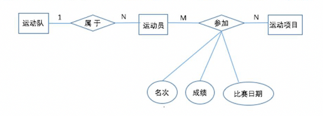

### 逻辑结构设计方法(综合应用)
#### E-R图向关系模型的转换
#### 数据模型的优化
#### 设计用户子模式

### 物理设计方法(识记)
#### 建立索引
#### 建立聚焦
