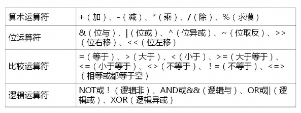
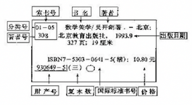
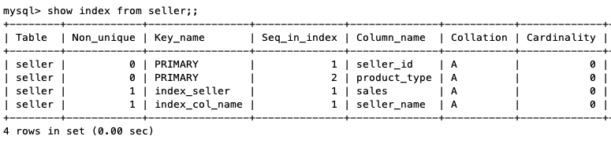

# SQL与关系数据库基本操作

## 1.SQL概述(识记)
### 什么是SQL
SQL(Structured Query Language) 结构化查询语句，是专门用来与数据库通信的语言，它可以帮助用户操作关系数据库。

### SQL特点
1. SQL不是某个特定数据库供应商专有的语言（mysql, oracle, sql server等）
2. SQL简单易学
3. SQL强大、灵活，可以进行非常复杂和高级的数据操作

### SQL的组成
数据查询、数据定义、数据操纵、数据控制

- 数据定义语言(Data Definition Language, DDL)
  - CREATE 创建数据库或数据库对象
  - ALTER 对数据库或数据库对象进行修改
  - DROP 删除数据库或数据库对象
- 数据操纵语言(Data Manipulation Language, DML)
  - SELECT 从表或视图中检索数据
  - INSERT 将数据插入到表或视图中
  - UPDATE 修改表或视图中的数据
  - DELETE 从表或视图中删除数据
- 数据控制语言(Data Control Language, DCL)
  - GRANT 用于授予权限
  - REVOKE 用于收回权限

- 嵌入式和动态SQL规则：规定了SQL语句在高级语言程序设计中使用的规范方法，以便适应较为复杂的应用。
- SQL调用和会话规则


### 练习题
1.SQL又称为（  ）。单选题，答案：C
- A 结构化定义语言
- B 结构化控制语言
- C 结构化查询语言
- D 结构化操纵语言

2.数据定义语言包括的主要SQL语句有CREATE、ALTER和（  ）。填空题，答案：DROP

3.用于从表或视图中检索数据的语句是（  ）。单选题，答案：A
- A SELECT语句
- B INSERT语句
- C UPDATE语句
- D DELETE语句

## 2.MySQL预备知识
### MySQL使用基础(识记)
关系数据库管理系统(RDBMS)
- LAMP（Linux Apache MySQL PHP）
- WAMP（Windows Apache MySQL PHP）

### MySQL扩展语言要素(领会)
#### 常量
- **字符串常量**，也称字面值或标量值。用单引号或双引号括起来的字符序列，分为ASCII字符串常量和Unicode字符串常量。
- **数值常量**，整数常量、浮点数常量
- **十六机制常量**，每对16进制数字转换为一个字符，其最前面有一个字母'X'(或'x')
- **时间日期常量**，用单引号表示日期时间的字符串括起来构成的，如：'2018-06-05'
- **位字段值**，二进制
- **布尔值**，1 或 0
- **NULL值**，表示没有值，空的

#### 变量
- 用户变量，用户变量前常添加一个符号：@，用于将其与列名分开。
  ```bash
  mysql -uroot -p # 登录数据库
  set @sun=1; # 设置一个用户变量
  ```
- 系统变量，大多数系统变量应用于其他SQL语句中时，必须在系统变量前加**两个@**

#### 运算符



#### 表达式
表达式是常量、变量、列名、复杂计算、运算符和函数的组合。例如："2018-06-05"、@A、SNO、s.b=r.b、A+b
- 字符型表达式
- 数值型表达式
- 日期型表达式

#### 内置函数
- 数学函数 ABS()...
- 聚合函数 COUNT()...
- 字符串函数 ASCII()...
- 日期何时间函数 NOW()...
- 加密函数 ENCODE()...
- 控制流程函数 IF()...
- 格式化函数 FORMAT()...
- 类型转换函数 CAST()...
- 系统信息函数 USER()...

```bash
select now() # 会显示当前时间 { now(): '2020-02-12 00:36:23' } 
select count(*) from tb_access; # { count(*): 182388 }
```

#### 练习题
1.布尔值包含两个可能的值，分别是 TRUE 和 （ ），填空题，答案：FALSE

2.算术运算符有：加、减、乘、除、（  ）。填空题，答案：求模

3.逻辑运算符&&表示（  ）。单选题，答案：B
- A 逻辑非
- B 逻辑与
- C 逻辑或
- D 逻辑异或

4.根据表达式的值的数据类型，表达式可分为字符型表达式、数值型表达式和（  ）表达式。填空题，答案：日期型

### MySQL的安装与配置(识记)
mac下安装参考：http://www.zuo11.com/blog/2016/10/db_mysql_basecmd.html

## 3.数据定义(重要)
### 3.1数据库模式定义(综合应用)
模式也可以叫做表，关系模式 => 关系表 

#### 创建数据库
使用 create database 或 create schema 语句

```bash
create {database | schema} [if not exists] db_name
[default] character set [=] charset_name # 指定字符集
| [default] collate [=] collation_name # 指定字符集的校对规则，可以理解为排序

# collate [kəˈleɪt] 校对
# []标示其内容为可选项；| 用于分隔花括号中的选择项

# 示例
create database mysql_test
show databases; # 查看数据库
```
#### 选择数据库
选择数据库或者从一个数据库切到另一个数据库

```bash
use database_name;

# 示例
use mysql_test;
```

#### 修改数据库

```bash
alter {database | schema} [db_name] alter_specification...
# specification [ˌspesɪfɪˈkeɪʃn] 规格，说明

# 示例，修改数据库默认字符集
alter database mysql_test default character set gb2312 default collate gb2312_chinese_ci;

# 使用status可以查看当前数据库信息，看是否修改成功
status;
show variables like '%char%'; # 或者这个命令也可以
```

#### 删除数据库

```bash
drop {database | schema} [if exists] db_name;

# 示例
 drop database if exists mysql_test;
```

#### 查看数据库

```bash
show {databases | schemas}
[like 'pattern' | where expr] 
# like关键字用于匹配指定的数据库名称
# where从句用于指定数据库名称查询范围的条件

# 示例
show databases like '%my%';
```

#### 练习题
1.在mysql中，可以使用（  ）语句来创建数据库。单选题，答案：A
- A create database
- B alter database
- C drop database
- D show database

2.在mysql中，通常用来指定一个已有数据库作为当前工作数据库的语句是（  ）。单选题，答案：D
- A using
- B used
- C uses
- D use

3.建一个名为student的数据库；建一个名为teacher的数据库；选择student数据库；删除teacher数据库；

```bash
create database if not exists student;
create database if not exists teacher;
use student;
drop database if exists teacher;
```

### 3.2表定义(综合应用)
#### 创建表
数据表，被定义为字段的集合，按 **行** 和 **列** 的格式来存储的，每一 **行** 代表一条及记录。每一**列**代表记录中一个字段的取值。**确定表中每个字段的数据类型**

```bash
create [temporary] table  tb_name (
  字段名1 数据类型 [列级完整性约束条件] [默认值]
  [, 字段名2 数据类型 [列级完整性约束条件] [默认值]]
  [, ...]
  [, 表级完整性约束条件]
)[engint=引擎类型];

# temporary 是否是临时表
# 例子：在一个已有数据库mysql_test中新建一个包含客户姓名、性别、地址、联系方式等内容的客户基本信息表，要求将客户的id号指定为该表的主键
create table customers (
  cust_id int not null auto_increment comment '客户id',
  cust_name char(50) not null comment '客户姓名',
  cust_sex char(1) not null comment '客户性别',
  cust_address char(50) null comment '客户地址',
  cust_contact char(50) null comment '客户联系方式',
  create_time timestamp default current_timestamp comment '创建时间',
  primary key(cust_id)
) comment '客户基本信息表';

# cust_id int not null auto_increment primary key comment '客户id',

# show tables;
+----------------------+
| Tables_in_mysql_test |
+----------------------+
| customers            |
+----------------------+

# desc customers
+--------------+-----------+------+-----+-------------------+-------------------+
| Field        | Type      | Null | Key | Default           | Extra             |
+--------------+-----------+------+-----+-------------------+-------------------+
| cust_id      | int(11)   | NO   | PRI | NULL              | auto_increment    |
| cust_name    | char(50)  | NO   |     | NULL              |                   |
| cust_sex     | char(1)   | NO   |     | NULL              |                   |
| cust_address | char(50)  | YES  |     | NULL              |                   |
| cust_contact | char(50)  | YES  |     | NULL              |                   |
| create_time  | timestamp | YES  |     | CURRENT_TIMESTAMP | DEFAULT_GENERATED |
+--------------+-----------+------+-----+-------------------+-------------------+
```

#### 更新表 alter table
使用 **alter table**语句，增加或删除列，创建或取消索引，更改原有列的数据类型、重新命名列或表，更改表的评注何表的引擎类型，为表重新创建触发器、存储过程、索引和外键等。

##### add [column]
向表里面增加一列

```bash
# 向数据库mysql_test的表customers中添加一列，并命名为cust_city，要求其不能为NULL，默认值为 "Wuhan"，且该列谓语原表cust_sex列之后。

alter table mysql_test.customers add cust_city char(10) not null default "Wuhan" comment "客户所在城市" after cust_sex;

# mysql> desc customers;
+--------------+-----------+------+-----+-------------------+-------------------+
| Field        | Type      | Null | Key | Default           | Extra             |
+--------------+-----------+------+-----+-------------------+-------------------+
| cust_id      | int(11)   | NO   | PRI | NULL              | auto_increment    |
| cust_name    | char(50)  | NO   |     | NULL              |                   |
| cust_sex     | char(1)   | NO   |     | NULL              |                   |
| cust_city    | char(10)  | NO   |     | Wuhan             |                   |
| cust_address | char(50)  | YES  |     | NULL              |                   |
| cust_contact | char(50)  | YES  |     | NULL              |                   |
| create_time  | timestamp | YES  |     | CURRENT_TIMESTAMP | DEFAULT_GENERATED |
+--------------+-----------+------+-----+-------------------+-------------------+

```
##### change [column]
修改表中列的名称或数据类型

```bash
# 示例：将cust_sex 列改为 sex
alter table mysql_test.customers change column cust_sex sex char(1) null default "M";

# mysql> desc customers;
+--------------+-----------+------+-----+-------------------+-------------------+
| Field        | Type      | Null | Key | Default           | Extra             |
+--------------+-----------+------+-----+-------------------+-------------------+
| cust_id      | int(11)   | NO   | PRI | NULL              | auto_increment    |
| cust_name    | char(50)  | NO   |     | NULL              |                   |
| sex          | char(1)   | YES  |     | M                 |                   |
| cust_city    | char(10)  | NO   |     | Wuhan             |                   |
| cust_address | char(50)  | YES  |     | NULL              |                   |
| cust_contact | char(50)  | YES  |     | NULL              |                   |
| create_time  | timestamp | YES  |     | CURRENT_TIMESTAMP | DEFAULT_GENERATED |
+--------------+-----------+------+-----+-------------------+-------------------+
```

##### alter [column]
修改或删除表中指定列的默认值

```bash
# 修改列的默认值
alter table mysql_test.customers alter column cust_city set default 'Beijing';

# mysql> desc customers;
+--------------+-----------+------+-----+-------------------+-------------------+
| Field        | Type      | Null | Key | Default           | Extra             |
+--------------+-----------+------+-----+-------------------+-------------------+
| cust_id      | int(11)   | NO   | PRI | NULL              | auto_increment    |
| cust_name    | char(50)  | NO   |     | NULL              |                   |
| sex          | char(1)   | YES  |     | M                 |                   |
| cust_city    | char(10)  | NO   |     | Beijing           |                   |
| cust_address | char(50)  | YES  |     | NULL              |                   |
| cust_contact | char(50)  | YES  |     | NULL              |                   |
| create_time  | timestamp | YES  |     | CURRENT_TIMESTAMP | DEFAULT_GENERATED |
+--------------+-----------+------+-----+-------------------+-------------------+
```

##### modifiy [column]
只修改指定列的数据类型，不会干涉其列名
```bash
# 修改cust_name 为第一列，改为 char(20)
alter table mysql_test customers modify column cust_name char(20) first;

# mysql> desc customers;
+--------------+-----------+------+-----+-------------------+-------------------+
| Field        | Type      | Null | Key | Default           | Extra             |
+--------------+-----------+------+-----+-------------------+-------------------+
| cust_name    | char(20)  | YES  |     | NULL              |                   |
| cust_id      | int(11)   | NO   | PRI | NULL              | auto_increment    |
| sex          | char(1)   | YES  |     | M                 |                   |
| cust_city    | char(10)  | NO   |     | Beijing           |                   |
| cust_address | char(50)  | YES  |     | NULL              |                   |
| cust_contact | char(50)  | YES  |     | NULL              |                   |
| create_time  | timestamp | YES  |     | CURRENT_TIMESTAMP | DEFAULT_GENERATED |
+--------------+-----------+------+-----+-------------------+-------------------+
```

##### drop [column]
删除列表中的列
```bash
# 删除列
alter table mysql_test.customers drop column cust_contact;

# mysql> desc customers;
+--------------+-----------+------+-----+-------------------+-------------------+
| Field        | Type      | Null | Key | Default           | Extra             |
+--------------+-----------+------+-----+-------------------+-------------------+
| cust_name    | char(20)  | YES  |     | NULL              |                   |
| cust_id      | int(11)   | NO   | PRI | NULL              | auto_increment    |
| sex          | char(1)   | YES  |     | M                 |                   |
| cust_city    | char(10)  | NO   |     | Beijing           |                   |
| cust_address | char(50)  | YES  |     | NULL              |                   |
| create_time  | timestamp | YES  |     | CURRENT_TIMESTAMP | DEFAULT_GENERATED |
+--------------+-----------+------+-----+-------------------+-------------------+
```

##### rename to
修改表名

```bash
# 修改表名
alter table mysql_test.customers rename to mysql_test.backup_customers;

# mysql> show tables 
+----------------------+
| Tables_in_mysql_test |
+----------------------+
| backup_customers     |
+----------------------+

```

#### 删除表 drop table
```bash
drop [temporary] table [if exists] tb_name [, tb2_name, ...] [restrict | cascade]
# restrict [rɪˈstrɪkt] 限定、约束
# cascade  [kæˈskeɪd] 串联

# 删除表
drop table if exists backup_customers;

# mysql> show tables;
Empty set (0.01 sec)
```

#### 查看表 show tables
```bash
# 查看数据表
show [full] tables [{from | in} db_name] [like 'pattern' | where expr]

show tables;

# 查看表结构
{desc | describe} tb_name [column | wild]

# 示例
create table tb_test (id int auto_increment, name varchar(20), age int, primary key(id));

# mysql> show tables;
+----------------------+
| Tables_in_mysql_test |
+----------------------+
| tb_test              |
+----------------------+

# show columns from tb_test; 与 desc tb_test 等价
# mysql> describe tb_test;
+-------+-------------+------+-----+---------+----------------+
| Field | Type        | Null | Key | Default | Extra          |
+-------+-------------+------+-----+---------+----------------+
| id    | int(11)     | NO   | PRI | NULL    | auto_increment |
| name  | varchar(20) | YES  |     | NULL    |                |
| age   | int(11)     | YES  |     | NULL    |                |
+-------+-------------+------+-----+---------+----------------+
3 rows in set (0.00 sec)

# 只看一个字段
# mysql> desc tb_test name; 
+-------+-------------+------+-----+---------+-------+
| Field | Type        | Null | Key | Default | Extra |
+-------+-------------+------+-----+---------+-------+
| name  | varchar(20) | YES  |     | NULL    |       |
+-------+-------------+------+-----+---------+-------+
1 row in set (0.01 sec)
```

#### 练习题
1.在mysql中，可以使用（  ）语句来更改原有表的结构，包括增加、删减列等操作。单选题，答案：B
- A alter database
- B alter talbe
- C create table
- D create databases

2.在创建表的create table 语句中，若添加可选项 "temporary" 关键字，则表示使用该语句创建的表为 （  ）。填空题，答案：临时表

3.在create table语句中，通常使用关键字 (  ) 来指定主键。填空题，答案：primary key

4.新建一个包含客户姓名、性别、地址、联系方式等内容的客户基本信息表，要求将客户的id号指定为该表的主键，给横线处填空，SQL语句如下：
```bash
mysql > user mysql_test;
Database changed
mysql > create table customers
-> (
-> cust_id int not null auto_increment,
-> cust_name char(1) not null,
-> cust_sec char(1) not null default 0,
-> cust_address char(50) null,
-> cust_contact char(50) null,
-> _______(cust_id)
-> ); 
```
填空题，答案：primary key 

5.将数据库mysql_test中表customers的cust_sex列重命名为sex，且将其数据类型更改为字符长度为1的字符数据类型char(1)，允许其为NULL，默认值为字符常量 'M'。写出相关的SQL语句。设计题

```bash
alter table mysql_test.customers change column cust_sex sex char(1) null default 'M';
```

6.重名表可以使用alter table语句或（  ）table 语句。填空题，答案：rename

7.显示表结构使用的语句是（  ）。单选题，答案：B
- A show tables
- B show columns
- C display tables
- D display columns

### 3.3索引定义(综合应用)
索引是提高数据文件访问效率的有效方法



索引存在的弊端：
- 索引是以文件的形式存储的，如果有大量的索引，索引文件可能比数据文件更快达到最大的文件尺寸。
- 索引在提高查询速度的同时，会降低更新表的速度。

索引的分类:
- 普通索引(index或key)
- 唯一性索引(unique)
- 主键(primary key)

索引通常被创建成单列索引和组合索引

#### create index创建索引
```bash
# unique 创建唯一性索引
# index_name 指定索引名
# 在表 tb1_name 上创建索引
# index_col_name 关于索引列的描述
create [unique] index index_name on tb1_name(index_col_name, ...)

# 索引列描述
# ASC 升序(默认) DESC 降序
col_name[(length)][ASC | DESC]

# 例子1：
# 在数据库 mysql_test 的表 customers 上，根据客户姓名列的前三个字符创建一个升序索引index_customers。
create index index_customers on mysql_test.customers(cust_name(3) ASC);

# 例子2：
# 在数据库 mysql_test 的表 customers 上，根据客户姓名列和客户id号创建一个组合索引index_cust
create index index_cust on mysql_test.customers(cust_name,cust_id);

```

#### create table创建索引
```bash
# constraint [kənˈstreɪnt] 约束
# 1.使用主键，语法项 [constraint[symbol]] primary key(index_col_name, ...)
#   用于表示在创建新表的同时创建该表的主键
# 2.语法项 {index | key} [index_name](index_col_name, ...)
#   用于表示在创建新表的同时创建该表的索引
# 3.语法项 [constranit[symbol]] unique [index|key] [index_name](index_col_name, ...)
#   用于表示在创建新表的同时创建该表的唯一性索引
# 4.语法项 [constraint[symbol]] foreign key [index_name](index_col_name, ...)
#   用于表示在创建新表的同时创建该表的外键
```
例子: 在已有数据库mysql_test上新建一个包含产品卖家id号，姓名、地址、联系方式、售卖产品类型、当月销量等内容的产品卖家信息表seller。要求在创建的同时，为该表添加由卖家id号和售卖产品类型组成的联合主键，并在当月销量上创建索引。
```bash
create table seller (
  seller_id int not null auto_increment,
  seller_name char(50) not null,
  seller_address char(50) null,
  seller_contact char(50) null,
  product_type int(5) not null,
  sales int null comment '当月销量',
  primary key(seller_id, product_type),
  index index_seller(sales)
);

# primary key(seller_id, product_type) 主键索引
# index index_seller(sales) # 创建index_seller的索引
```

#### alter table创建索引
```bash
# 1.语法项：add {index | key} [index_name](index_col_name, ...)
#   用于表示在修改表的同时为该表添加索引
# 2.语法项：add [constraint[symbol]] primary key (index_col_name, ...)
#   用于表示在修改表的同时为该表添加主键
# 3.语法项：add [constraint[symbol]] unique [index|key] [index_name](index_col_name,...)
#   用于表示在修改表的同时为该表添加唯一性索引
# 4.语法项: add [constraint[symbol]] foreign key (index_col_name)
#   用于表示在创建新表的同时为该表添加外键
```
使用alter table语句在数据库mysql_test中表seller的姓名上添加一列非唯一的索引，取名index_seller_name
```bash
alter table mysql_test.seller add index index_col_name(seller_name);
```

#### show index查看索引
```bash
show {index | indexs | keys} {from | in} tb_name [{from | in} db_name] [where expr]

# 示例
# show index in seller; 
show index from seller; 
```



#### drop index 删除索引
```bash
drop index index_name on tb_name;

# 示例：删除 customers 表中的索引 index_cust
drop index index_cust on customers;
```

#### alter table删除索引
1. 选用drop primary key 子句用于删除表中的主键，由于一个表中只有一个主键，其也是一个索引。
2. 选用drop index 子句用于删除各种类型的索引
3. 选用drop foreign key 子句用于删除外键

```bash
# 示例：
# 使用alter table语句删除数据库mysql_test中表customers的主键和索引index_customers。
alter table customers drop primary key; # mysql必须有一个主键，无法删除 Error
alter table customers drop index index_customers; 
alter table customers drop primary key, drop index index_customers; # Error
```

#### 练习题
1.所谓（  ），就是DBMS根据表中的一列或若干列按照一定顺序建立的列值与记录行之间的对应关系表。填空题，答案：索引

2.下面哪个语句不能创建索引（  ）。单选题，答案：D
- A create index
- B create table
- C alter table
- D alter index

3.使用alter table语句在数据库mysql_test中表seller的姓名列上添加一个非唯一的索引，取名为index_seller_name。设计题

```bash
alter table mysql_test.seller add index index_seller_name(seller_name);
```

## 4.数据更新(重要)
### insert 插入数据(综合应用)
```bash
# 插入数据语法:
insert [into] tb1_name [(col_name, ...)] {values | value} ({expr | default}, ...), (...), ...
# expr 表示一个常量、变量或一个表达式，也可以是空值，NULL
# default 指定此列值为该列的默认值
```

#### insert...values 插入单行或多行数据

示例：使用insert...values语句向数据库mysql_test的表customers中插入这样一行完整数据：
```bash
(901, 张三, F, 北京市, 朝阳区)

insert mysql_test.customers values (901, '张三', 'F', '北京市', '朝阳区', '2019-05-13');


# mysql> select * from customers;
+---------+-----------+----------+--------------+--------------+---------------------+
| cust_id | cust_name | cust_sex | cust_address | cust_contact | create_time         |
+---------+-----------+----------+--------------+--------------+---------------------+
|     901 | 张三       | F        | 北京市        | 朝阳区        | 2019-05-13 00:00:00 |
+---------+-----------+----------+--------------+--------------+---------------------+
1 row in set (0.00 sec)

insert into mysql_test.customers (cust_id,cust_name,cust_sex,cust_address,cust_contact) values (902, '李四', 'F', '北京市', '朝阳区');

# mysql> select * from customers;
+---------+-----------+----------+--------------+--------------+---------------------+
| cust_id | cust_name | cust_sex | cust_address | cust_contact | create_time         |
+---------+-----------+----------+--------------+--------------+---------------------+
|     901 | 张三       | F        | 北京市        | 朝阳区        | 2019-05-13 00:00:00 |
|     902 | 李四       | F        | 北京市        | 朝阳区        | 2020-02-12 22:09:10 |
+---------+-----------+----------+--------------+--------------+---------------------+
2 rows in set (0.00 sec)

# 使用insert...values插入多行数据
INSERT INTO table_name (column1,column2,column3,...)
VALUES (value1,value2,value3,...),(value1,value2,value3,...),(value1,value2,value3,...)
```


#### insert...set插入部分列数据
```bash
# 语法
insert [into] tb1_name set col_name={expr | default},...
```
示例：使用insert...set语句向数据库mysql_test的表customers中插入数据：名为李四，地址为武汉，性别默认
```bash
alter table customers change cust_sex cust_sex char(1) default 'M' not null;
insert mysql_test.customers set cust_name='李四',cust_address='武汉';

# mysql> select * from customers;
+---------+-----------+----------+--------------+--------------+---------------------+
| cust_id | cust_name | cust_sex | cust_address | cust_contact | create_time         |
+---------+-----------+----------+--------------+--------------+---------------------+
|     901 | 张三       | F        | 北京市        | 朝阳区        | 2019-05-13 00:00:00 |
|     902 | 李四       | F        | 北京市        | 朝阳区        | 2020-02-12 22:09:10 |
|     903 | 李四       | M        | 武汉          | NULL         | 2020-02-12 22:19:03 |
+---------+-----------+----------+--------------+--------------+---------------------+
3 rows in set (0.00 sec)
```

#### insert...select插入子查询数据
将从一个表中 select 查询到的一行数据，直接插入到另一个表中，注意：列名要相对应，否则会报错
```bash
# 语法：
insert [into] tb1_name [{col_name, ...}] select ...
```

### delete 删除数据(综合应用)
```bash
# 语法：
delete from tb1_name [where where_condition] [order by ...] [limit row_count]

# 示例：
delete from customers where cust_id > 902; # 删除cust_id > 902的数据 
delete from customers; # 删除表里的所有数据
```
### update 修改数据(综合应用)
```bash
# 语法：
update tb1_name set col_name1={expr1 | default} [, col_name2 = {expr1 | default}]...
[where where_condition] [order by ...] [limit row_count]
```
示例：使用update语句将数据库mysql_test的表customers中姓名为"张三"的客户的地址更新为"武汉"

```bash
update mysql_test.customers set cust_address='武汉' where cust_name='张三';
```

### 练习题
1.使用（  ）语句可以插入单行或多行元组数据。填空题，答案：insert...values

2.使用delete语句删除数据库mysql_test的表customers中客户名为"李四"的客户信息。设计题

```bash
delete from mysql_test.customers where cust_name='李四';
```

## 5.数据查询(综合应用)
### select语句
```bash
# 语句
select [all | distinct | distinctrow] # distinctrow [dɪˈstɪŋkt] 不同的，明显的
select_expr [, select_expr...]
from table_references # 数据来源
[where where_condition] # 条件
[group by {col_name | expr | position} [asc | desc], ... [with rollup]] # 对检索到的数据进行分组
[having where_condition] # 指定组的选择条件
[order by {col_name | expr | position} [asc | desc], ...] # 对查询结果进行排序
[limit {[offset_val,] row_count | row_count offset offset_val}] # 限制行数
```

### 列的选择与指定
查询数据库mysql_test的表customers中各个客户的姓名、性别和地址信息
```bash
select cust_name,cust_sex,cust_address from mysql_test.customers;

# mysql> select cust_name,cust_sex,cust_address from mysql_test.customers;
+-----------+----------+--------------+
| cust_name | cust_sex | cust_address |
+-----------+----------+--------------+
| 张三       | F        | 武汉         |
| 李四       | F        | 北京市       |
| 李四       | M        | 武汉         |
+-----------+----------+--------------+
3 rows in set (0.01 sec)

# 查询数据库mysql_test的表customers中各个客户的所有信息
select * from mysql_test.customers;

```
#### 定义并使用列的别名
```bash
# 语法
column_name [as] colums_alias

# 示例
select cust_name,cust_address as 地址,cust_contact from mysql_test.customers;
# mysql> select cust_name,cust_address as 地址,cust_contact from mysql_test.customers;
+-----------+-----------+--------------+
| cust_name | 地址      | cust_contact |
+-----------+-----------+--------------+
| 张三       | 武汉      | 朝阳区       |
| 李四       | 北京市    | 朝阳区       |
| 李四       | 武汉      | NULL         |
+-----------+-----------+--------------+
```
#### 替换查询结果集中的数据
```bash
# 语法
case 
when 条件1 then 表达式1
  when 条件2 then 表达式2
  ...
else 表达式
end [as] column_alias
```
例子：查询数据库mysql_test的表customers中客户的cust_name和cust_sex列，要求判断结果集中cust_sex列的值，如果该列的值为M，则显示输出"男"，否则为 "女"，同时在结果集的显示中将cust_sex列用别名 "性别"标注
```bash
select cust_name, 
case 
when cust_sex='M' then '男' 
else '女' 
end as 性别 
from mysql_test.customers;

+-----------+--------+
| cust_name | 性别   |
+-----------+--------+
| 张三       | 女     |
| 李四       | 女     |
| 李四       | 男     |
+-----------+--------+
```

#### 计算列值
例子：查询数据库mysql_test的表customers中每个客户的cust_name列，cust_sex列，以及对cust_id列加上数字100后的结果
```bash
select cust_name,cust_sex,cust_id+100 from mysql_test.customers;

# mysql> select cust_name,cust_sex,cust_id+100 from mysql_test.customers;
+-----------+----------+-------------+
| cust_name | cust_sex | cust_id+100 |
+-----------+----------+-------------+
| 张三      | F        |        1001 |
| 李四      | F        |        1002 |
| 李四      | M        |        1004 |
+-----------+----------+-------------+
```
#### 聚合函数

函数名 | 说明
--- | ---
count | 求组中项数，返回int类型整数
max | 求最大值
min | 求最小值
sum | 求表达式中所有值的和
avg | 求组中值的平均值
std 或 stddev | 返回给定表达式中所有值的标准值
variance | 返回给定表达式中所有值的方差
group_concat | 返回由属于一组的列值连接组合而成的结果
bit_and | 逻辑或
bir_or | 逻辑与
bit_xor | 逻辑异或

#### 练习题
1.使用SQL语句中进行查询操作是，若希望查询出全部存在的元组。一般使用的保留字是（  ）。单选题，答案：D
- A Unique
- B Except
- C Distinct
- D All

2.select语句的子句中，仅在按组计算聚合时使用的是（  ）。单选题：C
- A FROM
- B WHERE
- C GROUP BY
- D ORDER BY

3.查询数据库mysql_test的表customers中各个客户的所有信息，写出相应SQL语句。设计题

```bash
select * from mysql_test.customers;
```

4.聚合函数通常是数据库系统中一类系统（  ）。填空题，答案：内置函数

5.在数据查询时，替换查询结果集中的数据需要用到（  ）表达式。填空题，答案：case

6.查询数据库mysql_test的表customers中客户的cust_name列何cust_sex列，要求判断结果集中cust_sex列的值，如果该列的值为M，则显示输出'男'，否则为'女'，同时在结果集的显示中将cust_sex用列名 "性别"标注，写出SQL语句。设计题

```bash
select cust_name,
case 
when cust_sex='M' then '男'
else '女'
end as 性别
from mysql_test.customers;
```

7.请写出定义并使用列的别名的语法格式。简答题

```bash
colunm_name [as] colum_alias #  [ˈeɪliəs] 别名
```

8.下列选项中用来表示组中项数的聚合函数是（  ）。单选题，答案：A
- A count
- B sum
- C avg
- D std

### from子句与多表连接查询
#### 交叉连接(笛卡尔积)
```bash
select * from tb1 cross join tb2;
# 等价于
select * from tb1,tb2;

# 示例
create table tb1 (tb1_id int primary key, tb1_col char(10) not null);
create table tb2 (tb2_id int primary key, tb2_col char(10) not null);
insert tb1 values (1, 'tb1_a'),(2, 'tb1_b'),(3, 'tb1_c');
insert tb2 values (1, 'tb2_a'),(2, 'tb2_b'),(3, 'tb2_c');

# mysql> select * from tb1;
+--------+---------+
| tb1_id | tb1_col |
+--------+---------+
|      1 | tb1_a   |
|      2 | tb1_b   |
|      3 | tb1_c   |
+--------+---------+
3 rows in set (0.00 sec)

# mysql> select * from tb2;
+--------+---------+
| tb2_id | tb2_col |
+--------+---------+
|      1 | tb2_a   |
|      2 | tb2_b   |
|      3 | tb2_c   |
+--------+---------+
3 rows in set (0.01 sec)

# mysql> select * from tb1 cross join tb2;
# 或者 mysql> select * from tb1,tb2;
+--------+---------+--------+---------+
| tb1_id | tb1_col | tb2_id | tb2_col |
+--------+---------+--------+---------+
|      1 | tb1_a   |      1 | tb2_a   |
|      2 | tb1_b   |      1 | tb2_a   |
|      3 | tb1_c   |      1 | tb2_a   |
|      1 | tb1_a   |      2 | tb2_b   |
|      2 | tb1_b   |      2 | tb2_b   |
|      3 | tb1_c   |      2 | tb2_b   |
|      1 | tb1_a   |      3 | tb2_c   |
|      2 | tb1_b   |      3 | tb2_c   |
|      3 | tb1_c   |      3 | tb2_c   |
+--------+---------+--------+---------+
9 rows in set (0.00 sec)
```

#### 内连接
```bash
# select some_colums from tb1 inner join tb2 on some_conditions;
# 大写更好理解，以后要改掉全小写的习惯
SELECT some_colums FROM tb1 INNER JOIN tb2 ON some_conditions;
# some_conditions [tb1.]<列名或列别名><比较运算符>[tb2.]<列名或列别名>
# tb1.b = tb2.b
```
例子：根据学生基本信息登记表tb_student何学生成绩表tb_score，使用内连接查询每个学生及其选课成绩的详细信息
```bash
# 默认是INNER 内连接，不写INNER，直接写 JOIN就是内连接
SELECT * FROM tb_student INNER JOIN tb_score ON tb_student.stu_id=tb_score.stu_id;
```
内连接分类
- 等值连接：使用运算符 =
- 非等值连接：使用除 = 之外的其它比较运算符
- 自连接：将一个表与它自身进行连接

#### 外连接
在内连接中，一般都是查询到的满足条件的数据，而外连接可以获取到满足条件的和不满足条件的数据

1. 左外连接：在FROM子句中使用关键字 LEFT OUTER JOIN 或 LEFT JOIN
2. 右外连接：在FROM子句中使用关键字 RIGHT OUTER JOIN 或 RIGHT JOIN

例子：根据学生基本信息登记表tb_student何学生成绩表tb_score，使用左连接查询每个学生及其选课成绩的详细信息

```bash
# 基表为 tb_student
SELECT * FROM tb_student LEFT JOIN tb_score ON tb_student.stu_id=tb_score.stu_id;
```

#### 练习题
1.交叉连接又称（  ）。填空题，答案：笛卡尔积

2.SELECT语句的查询对象是由（  ）子句指定的。可根据用户的查询需求实现单表或多表查询。填空题：FROM

3.关于内连接的使用，可以将一个表与它本身进行连接，这种连接方式称为（  ）。单选，答案：A
- A 自连接
- B 等值连接
- C 非等值连接
- D 交叉连接

4.SELECT操作使用”连接“运算的连接方式不包括（  ）。单选题，答案：C
- A 交叉连接
- B 内连接
- C 串行连接
- D 外连接

5.假设数据库中有两张表，分别是tb1和tb2，现要求输出这两张表执行交叉连接后所有的数据集，写出相应的SQL。设计题

```bash
SELECT * FROM tb1,tb2;
# 或者
SELECT * FROM tb1 CROSS JOIN tb2;
```

6.写出在MySQL中，内连接的语法格式。简答题

```bash
SELECT ... FROM tb1 INNER JOIIN tb2 ON some_confition;
```

7.简述左外连接与右外连接的区别。简答题

左外连接：也称为左连接。以左表为基表。在FROM子句中使用关键字"LEFT OUTER JOIN" 或关键字 "LEFT JOIN"来连接两张表。

右外连接：也称为右连接。以右表为基表。在FROM子句中使用关键字"RIGHT OUTER JOIN" 或关键字 "RIGHT JOIN"来连接两张表。

8.关于内连接的使用，如若在ON子句的连接条件中使用运算符 "="，则此连接方式为（  ）。填空题，答案：等值连接

### where子句与条件查询
#### 比较运算

比较运算符 | 说明
--- | ---
= ，!= | 等于、不等于
< ，<= | 小于，小于等于
> ，>= | 大于，大于等于
<> | 不等于
<=> | 不等于，不返回UNKNOWN

不等于有三种，他们有什么区别？

一般where条件判断时，如果左右两边的表达式都不为NULL(空)，那么比较结果返回true或false，但是当左侧表达式或右侧表达式值为空(NULL)的时候，就会返回UNKNOWN。而 `<=>` 不会返回UNKNOWN，只会返回是否相等true or false

示例：在数据库mysql_test的表customers中查找所有男性客户的信息
```bash
SELECT * FROM mysql_test.customers WHERE cust_sex = 'M';
```

#### 判定范围 BETWEEN
当查询的过滤条件被限定在值的某个范围时，可以使用关键字 "BETWEEN"
```bash
# 语法
expression [NOT] BETWEEN expression1 AND expression2

# 例子：
# 在数据库mysql_test的表customers中，查询客户id号在903至912之间的客户信息
SELECT * FROM mysql_test.customers WHERE cust_id BETWEEN 903 AND 912;
```
#### 判定范围 IN
使用 IN 关键字可以指定一个值的枚举表，该表中会列出所有可能的值。
```bash
# 语法：
expression IN(expression1 [, ...n])

# 示例：查询ID为903，906，908的客户信息
SELECT * FROM mysql_test.customers WHERE cust_id IN(903,906,908);
```

#### 判定空值
```bash
# 语法
expression IS [NOT] NULL

# 示例：
SELECT cust_name FROM mysql_test.customers WHERE cust_contact IS NULL;
```

#### 练习题
1.当需要判断一个表达式的值是否为空值时，可以使用关键字（  ）来实现。填空题：IS NULL

2.在WHERE子句中，用于范围判定的关键字是（  ）和 （  ）。填空题：BETWEEN, IN

3.在where子句中，当查询的过滤条件被限定在值的某个范围时，其使用语法格式为：expression [NOT] （  ） Nexpresssion1 （  ） expression2。填空题 BETWEEN, AND

#### 子查询
两个查询嵌套

- 表子查询
- 行子查询
- 列子查询
- 标量子查询

##### 结合 IN 使用的子查询
主要用于判定一个给定值是否存在于子查询的结果集中
```bash
# 语法
expression [NOT] IN (subquery)
```
示例：查询任意所选课程成绩高于80分的学生的学号和姓名信息
```
SELECT stu_no,stu_name FROM tb_stu 
WHERE stu_no IN(SELECT stu_no FROM tb_score WHERE score > 80)
```

##### 结合比较运算符使用的子查询
```bash
# 语法
expression { = | < | <= | > | >= | <=> | <> | !=} {ALL | SOME | ANY} (subquery)
# IN 等同于 = any 等同于 = some
# NOT IN 等同于 <> ALL
SELECT stu_no,stu_name FROM tb_stu WHERE stu_no =any(SELECT stu_no FROM tb_score WHERE score > 80)
```
##### 结合 EXIST 使用子查询
```bash
# 语法
EXISTS (subquery)

SELECT stu_no,stu_name FROM tb_stu WHERE exists(SELECT * FROM tb_score WHERE tb_ste.stu_no = tb_score.stu_no)

# 子查询的结果不为空，则返回TRUE，否则返回FALSE
```

### group by子句与分组数据
```bash
# 语法
GROUP BY  {col_name | expr | position} [ASC | DESC],...[WITH ROLLUP]
# col_name 指定用于分组的选择列
# expr 指定用于分组的表达式
# position 指定用于分组的列在SELECT语句结果集中位置，通常是一个正整数
# WITH ROLLUP 可选项，指定在结果集中不仅包含由GROUP BY子句分组后的数据行，还包含各分组的汇总行，可以得到每个分组以及每个分组汇总级别的值
```
示例1：在数据库mysql_test的表customers中，获取一个数据结果集，要求该结果集中分别包含每个相同地址的男性客户人数和女性客户人数。
```bash
select cust_address,cust_sex,COUNT(*) AS 'renshu' FROM mysql_test.customers GROUP BY cust_address,cust_sex;

# mysql> select cust_address,cust_sex,COUNT(*) AS 'renshu' FROM mysql_test.customers GROUP BY cust_address,cust_sex;
+--------------+----------+--------+
| cust_address | cust_sex | renshu |
+--------------+----------+--------+
| 武汉          | F        |      2 |
| 北京市        | F        |      1 |
| 武汉          | M        |      1 |
+--------------+----------+--------+
3 rows in set (0.00 sec)

```
示例2：在数据库mysql_test的表customers中，获取一个数据结果集，要求该结果集中分别包含每个相同地址的男性客户人数和女性客户人数、总人数以及客户的总人数。
```bash
# 加上WITH ROLLUP, 
# mysql> select cust_address,cust_sex,COUNT(*) AS 'renshu' FROM mysql_test.customers GROUP BY cust_address,cust_sex WITH ROLLUP;
+--------------+----------+--------+
| cust_address | cust_sex | renshu |
+--------------+----------+--------+
| 北京市        | F        |      1 |
| 北京市        | NULL     |      1 | # 北京总人数
| 武汉          | F        |      2 |
| 武汉          | M        |      1 |
| 武汉          | NULL     |      3 | # 武汉总人数
| NULL         | NULL     |      4 | # 总人数
+--------------+----------+--------+
6 rows in set (0.01 sec)
```
### having子句 过滤分组
HAVING 一般与 GROUP BY 连用，用于过滤分组
```bash
# 语法
HAVING where_condition
# where_condition 指定过滤条件
```
HAVING 与 WHERE 的区别：
- HAVING用来过滤分组，WHERE用来过滤数据行
- HAVING可以包含聚合函数，WHERE不可以包含聚合函数
- HAVING在数据分组后进行过滤，WHERE在数据分组前过滤

示例：在数据库mysql_test的表customers中查找一类客户信息：要求在返回的结果集中，列出相同客户地址中满足客户人数少于3的所有客户姓名及其对应地址。

```bash
SELECT cust_name,cust_address FROM mysql_test.customers GROUP BY cust_address HAVING COUNT(*) < 3;

# mysql> SELECT cust_name,cust_address,COUNT(*) as  'renshu' FROM mysql_test.customers GROUP BY cust_address HAVING renshu < 3;
+-----------+--------------+--------+
| cust_name | cust_address | renshu |
+-----------+--------------+--------+
| 李四      | 北京市       |      1 |
+-----------+--------------+--------+
1 row in set (0.01 sec)

# mysql> SELECT cust_name,cust_address,COUNT(*) as  'renshu' FROM mysql_test.customers GROUP BY cust_address;
+-----------+--------------+--------+
| cust_name | cust_address | renshu |
+-----------+--------------+--------+
| 张三      | 武汉         |      3 |
| 李四      | 北京市       |      1 |
+-----------+--------------+--------+
2 rows in set (0.00 sec)
```

### order by子句
```bash
# 语法
ORDER BY {col_name | expr | position} {ASC | DESC}
# col_name 用于指定排序的列
# position 指定用于排序的列在SELECT语句结果集中的位置，通常是一个正整数
```
示例：在数据mysql_test的表customers中依次按照客户姓名和地址的降序方式输出客户的姓名和性别。
```bash
SELECT cust_name,cust_sex FROM mysql_test.customers ORDER BY cust_name DESC,cust_address DESC;

# mysql> SELECT cust_name,cust_sex FROM mysql_test.customers ORDER BY cust_name DESC,cust_address DESC;
+-----------+----------+
| cust_name | cust_sex |
+-----------+----------+
| 王五       | F        |
| 李四       | M        |
| 李四       | F        |
| 张三       | F        |
+-----------+----------+
```

### limit子句
```bash
# 语法
LIMIT {[offset,] row_count | row_count OFFSET offset}
# offset 可选项，默认为0，指定返回数据的第一行在SELECT语句结果集中的偏移量，必须是非负的证书常量 
# row_count 指定返回数据的行数，必须是非负的整数常量
# row_count OFFSET offset 从 offset+1行开始，取row_count行
```
示例：在数据库mysql_test的表customers中查找从第5位客户开始的3位客户的id号和姓名
```bash
SELECT cust_id,cust_name FROM mysql_test.customers LIMIT 3 OFFSET 4; 
SELECT cust_id,cust_name FROM mysql_test.customers LIMIT 4,3; 
# 从第5行开始的3行数据，(初始行为0,1,2,3,4,5)
```

### 练习题
1.设一个图书借阅管理数据库中包括三个关系模式：

图书（图书编号、书名、作者、出版社、单价）

读者（借书证号、姓名、性别、单位、地址）

借阅（借书证号、图书编号、借阅日期、归还日期、备注）

用SQL语句完成下面1-3题。设计图

(1)查询价格在50到60之间的图书，结果按出版社及单价升序排列
```bash
SELECT * FROM 图书 WHERE 价格 BETWEEN 50 AND 60 ORDER BY 出版社,单价;
```
(2)查询王明所借阅的所有图书的书名及借阅时间
```bash
SELECT 图书.书名,借阅.借阅时间 FROM 图书,读者,借阅 WHERE 姓名="王名" AND 借阅.借书证号=读者.借书证号 AND 图书.图书编号=借阅.图书编号;
```
(3) 查询各个出版社图书的最高价格、最低价格和平均价格。
```bash
SELECT 书名,出版社,MAX(单价) AS 最高价格,MIN(单价) AS 最低价格, AVG(单价) AS 平均价格 FROM 图书 GROUP BY 出版社;
```

2.在SELECT语句中，除了使用GROUP BY子句分钟数据之外，还可以使用（  ）子句来过滤分组。填空题：HAVING

3.设有一个关系模式图书(图书编号、书名、作者、出版社、单价)，查询价格在50-60元之间的图书，结果按出版社及单价升序排列，则下列用于排序的是 （  ）。单选题，答案：B
- A GROUP BY
- B ORDER BY
- C HAVING
- D LIMIT

## 6.视图(虚表，综合应用)
### 什么是视图(领会)
视图是数据库中的一个对象，它是数据库管理系统提供给用户的以多种角度观察数据库中数据的一种重要机制。

视图不是数据库中真实的表，而是一张虚拟的表，其自身并不存储数据。

### 使用视图的优点(领会)
- 集中分散的数据
- 简化查询语句
- 重用SQL语句
- 保护数据安全，看不到基表的其它信息，可以保护数据的安全
- 共享所需数据，多个人建多个视图，共享所需的数据
- 更改数据格式，比较灵活，可以在创建视图时修改数据的格式

### 创建视图 CREATE VIEW
```bash
# 语法
CREATE [OR REPLACE] VIEW view_name [(column_list)] AS select_statement 
[WITH [CASCADED | LOCAL] CHECK OPTION]]
# view_name 指定视图名称
# column_list 可选项 为每个列指定名称
# select_statement 指定 SELECT 语句
# [WITH [CASCADED | LOCAL] CHECK OPTION]] 可选项，指定在可更新视图上所进行的修改都需要符合select_statement中所指定的限制条件
```
示例：在数据mysql_test中创建视图customers_view，要求该视图包含客户信息表customers中所有男客户的信息，并且要求保证今后对该视图数据的修改都必须符合客户性别为男性这个条件。
```bash
CREATE OR REPLACE VIEW mysql_test.customers_view AS
SELECT * FROM mysql_test.customers WHERE cust_sex = 'M' 
WITH CHECK OPTION;

# SHOW TABLES; 可以查看到新建的视图
```
### 删除视图 DROP VIEW
```bash
# 语法
DROP VIEW [IF EXISTS] view_name [,view_name]...
[RESTICT | CASCADE]

DROP VIEW IF EXISTS customers_view;
```
### 修改视图定义 ALTER VIEW
对已有视图的定义（结构）进行修改
```bash
# 语法
ALTER VIEW view_name [(column_list)] AS select_statement 
[WITH [CASCADED | LOCAL] CHECK OPTION]]

ALTER VIEW customers_view (cust_id,cust_name) AS SELECT cust_id,cust_name FROM customers;

# mysql> select * from customers_view;
+---------+-----------+
| cust_id | cust_name |
+---------+-----------+
|     901 | 张三      |
|     902 | 李四      |
|     904 | 李四      |
|     909 | 周明      |
|     999 | 王五      |
+---------+-----------+
```

### 查看视图定义 SHOW CREATE VIEW
```bash
# 语法
SHOW CREATE VIEW view_name
# view_name 指定要查看视图的名称

# mysql> SHOW CREATE VIEW customers_view;
+----------------+-------------------------------------------------------------------------------------------------------------------------------------------------------------------------------------------------------------------------------------------------------------------------------------------------------------------------------------------------------------------------------------------------------------------------------------------------+----------------------+----------------------+
| View           | Create View                                                                                                                                                                                                                                                                                                                                                                                                                                     | character_set_client | collation_connection |
+----------------+-------------------------------------------------------------------------------------------------------------------------------------------------------------------------------------------------------------------------------------------------------------------------------------------------------------------------------------------------------------------------------------------------------------------------------------------------+----------------------+----------------------+
| customers_view | CREATE ALGORITHM=UNDEFINED DEFINER=`root`@`localhost` SQL SECURITY DEFINER VIEW `customers_view` AS select `customers`.`cust_id` AS `cust_id`,`customers`.`cust_name` AS `cust_name`,`customers`.`cust_sex` AS `cust_sex`,`customers`.`cust_address` AS `cust_address`,`customers`.`cust_contact` AS `cust_contact`,`customers`.`create_time` AS `create_time` from `customers` where (`customers`.`cust_sex` = 'M') WITH CASCADED CHECK OPTION | utf8                 | utf8_general_ci      |
+----------------+-------------------------------------------------------------------------------------------------------------------------------------------------------------------------------------------------------------------------------------------------------------------------------------------------------------------------------------------------------------------------------------------------------------------------------------------------+----------------------+----------------------+
1 row in set (0.01 sec)

```

### 更新视图数据 INSERT
#### INSERT 通过视图向基本表插入数据
示例：在数据库 mysql_test 中，向视图customer_view插入记录：(909, '周明', 'M', '武汉市', '洪山区')
```bash
INSERT INTO mysql_test.customers_view VALUES (909, '周明', 'M', '武汉市', '洪山区', '2019-12-12');
# mysql> SELECT * FROM customers_view;
+---------+-----------+----------+--------------+--------------+---------------------+
| cust_id | cust_name | cust_sex | cust_address | cust_contact | create_time         |
+---------+-----------+----------+--------------+--------------+---------------------+
|     904 | 李四       | M        | 武汉          | NULL        | 2020-02-12 22:48:38 |
|     909 | 周明       | M        | 武汉市        | 洪山区        | 2019-12-12 00:00:00 |
+---------+-----------+----------+--------------+--------------+---------------------+
```
#### UPDATE 通过视图修改基本表数据
示例：将视图customers_view中所有cust_address列更新为"上海市"
```bash
UPDATE mysql_test.customers_view SET cust_address = '上海市';
```
#### DELETE 通过视图删除基本表数据
示例：删除视图customers_view中姓名为 "周明" 的客户信息
```bash
DELETE FROM mysql_test.customers_view WHERE cust_name='周明';
```

### 查询视图数据
示例：在视图customers_view中查找客户id号为905的客户姓名及地址
```bash
SELECT cust_name,cust_address FROM mysql_test.customers_view WHERE cust_id=905;
```

### 练习题
1.下列关于视图的说法中错误的是（  ）。单选题：C
- A 视图是从一个或多个基本表导出的表，它是虚表
- B 视图是数据库中的一个对象
- C 视图是数据库中真实的表，而不是一张虚表
- D 视图可以用来定义新的视图

2.（  ）是用来查看存储在别处的数据的一种虚拟表，而其自身并不存储数据。填空题：视图

3.设有一个关系模式读者(借书证号，姓名，性别，单位，地址)，用SQL语句建立 "红星汽车厂" 读者的视图RST，则创建视图的语句是（  ）。单选题，答案：A
- A CREATE VIEW RST
- B ALTER VIEW
- C DROP VIEW RST
- D SHOW CREATE VIEW RST
