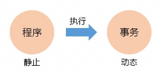

# 数据库安全与保护

## 数据库完整性
### 什么是数据库完整性(领会)
数据库完整性是指数据库中数据的**正确性**、**相容性**、**一致性**。

比如：性别一般只有男和女，身份证号是唯一的，年龄在0-150之间

### 完整性约束条件的作用对象(领会)
- 列级约束：包括对列的类型、取值范围、精度等约束
- 元组约束：指元组中各个字段之间的相互约束
- 表级约束：指若干元组、关系之间的联系的约束

### 定义与实现完整性约束(综合应用)
完整性约束的三个部分：

#### 实体完整性约束
实体完整性主要是通过**主键约束**和**候选键约束**实现的。必须有一个主键，主键不能为空。候选码是可以标识一行数据的，比如身份证号、学号，候选码中指定一个就是主键。

主键列必须遵守的规则：
1. 每一个表只能定义一个主键
2. 主键的值必须能够唯一标识表中的每一行数据，且不能为NULL
3. 复合主键不嫩包含不必要的多余列

约束方式 | 语句 | 关键字
--- | --- | ---
主键约束 | CREATE TABLE或ALTER TABLE | PRIMARY KEY
候选键约束 | CREATE TABLE或ALTER TABLE | UNIQUE

#### 参照完整性约束
外键的值如果不为NULL，那其值必须是被参照关系里的主键
```bash
# 语法
REFERENCES tbl_name(index_col_name,...)
[ON DELETE reference_option]
[ON UPDATE reference_option]
# references 参照
# tbl_name 指定外键所参照的表名
# index_col_name col_name[(length)][ASC|DESC]
# ON xxx 指定参照动作相关的SQL语句
# reference_option 指定参照完整性约束的实现策略, 包括 RESTRICT | CASCADE | SET NULL | NO ACTION
# restrict 限制策略，cascade 级联策略，set null 置空策略，no action 不采取实施策略
```
示例：在数据库mysql_test中创建一个商品订单表orders，该表包含订单号order_id，商品名order_product，商品类型order_product_type，客户id号cust_id，订购时间order_date，价格order_price，数量order_amount。要求商品订单表orders中的所有订购客户信息均已在customers中记录在册。
```bash
CREATE TABLE orders (
  order_id INT NOT NULL AUTO_INCREMENT COMMENT '订单号',
  order_product VARCHAR(100) NOT NULL COMMENT '商品名',
  order_product_type VARCHAR(50) NOT NULL COMMENT '商品类型',
  cust_id INT NOT NULL COMMENT '客户ID号',
  order_date DATETIME NOT NULL COMMENT '订购时间',
  order_price DOUBLE NOT NULL COMMENT '订购价格',
  order_amount INT NOT NULL COMMENT '订购数量',
  PRIMARY KEY(order_id),
  FOREIGN KEY(cust_id) REFERENCES customers(cust_id) ON DELETE RESTRICT ON UPDATE RESTRICT
) COMMENT '商品订单表';

# mysql> DESC ORDERS;
+--------------------+--------------+------+-----+---------+----------------+
| Field              | Type         | Null | Key | Default | Extra          |
+--------------------+--------------+------+-----+---------+----------------+
| order_id           | int(11)      | NO   | PRI | NULL    | auto_increment |
| order_product      | varchar(100) | NO   |     | NULL    |                |
| order_product_type | varchar(50)  | NO   |     | NULL    |                |
| cust_id            | int(11)      | NO   | MUL | NULL    |                |
| order_date         | datetime     | NO   |     | NULL    |                |
| order_price        | double       | NO   |     | NULL    |                |
| order_amount       | int(11)      | NO   |     | NULL    |                |
+--------------------+--------------+------+-----+---------+----------------+
7 rows in set (0.01 sec)
```

#### 用户定义完整性约束
用户自定义完整性约束包含：
- 非空约束 NOT NULL
- CHECK 约束 CHECK(expr)

### 命名完整性约束(简单应用)
命名完整性约束只能给基于表的完整性约束指定名字，无法给基于列的完整性约束指定名字
```bash
CONSTRAINT[symbol] 
# constraint  [kənˈstreɪnt] 约束
# symbol 指定的约束名字
```

### 更新完整性约束(简单应用)
使用ALTER TABLE更新与列或表有关的各种约束

1. 完整性约束不能直接被修改。（需要先删除，再增加）
2. 使用ALTER TABLE，可以独立地删除完整性约束，而不会删除表本身。（DROP TABLE语句删除一个表，则表中所有的完整性约束都自动删除）

### 练习题
1.在mysql中，各种完整性约束可通过CREAT TABLE 或 （  ）TABLE 语句来定义。填空题，答案：ALTER

2.完整性约束条件的作用对象可以是列、元组和（  ）。填空题，答案：表

3.候选键可以在CREATE TABLE 或 ALTER TABLE语句使用关键字 （  ）来定义。填空题，答案：UNIQUE

4.命名完整性约束的方法是在各种完整性约束的定义说明之前加上关键字（  ）和该约束的名字。填空题，答案：CONSTRAINT

## 触发器
什么是触发器？

触发器是用户定义在关系表上的一类由事件驱动的数据对象，也是一种保证数据库完整性的方法。

### 创建触发器(综合应用)
使用CREATE TRIGGER创建触发器
```bash
# 语法
CREATE TRIGGER trigger_name trigger_time trigger_event ON tbl_name FOR EACH ROW trigger_body
# trigger  [ˈtrɪɡə(r)] v 触发，n 扳机
# trigger_name 指定触发器的名字
# trigger_time 指定触发器被触发的时刻, 比如 AFTER、BEFORE
# trigger_event 指定触发的事件，比如 INSERT、DELETE、UPDATE
# tbl_name 指定与触发器相关联的表名，必须是永久性表，不能是临时表或视图
# FOR EACH ROW 指定对于受触发事件影响的每一行都要激活触发器的动作
# trigger_body 指定触发的动作主体
```
示例：在数据库 mysql_test 的表 customers 中创建一个触发器 customers_insert_trigger，用于每次向表customers插入一行数据时，将变量str的值设置为 one customer added!
```bash
CREATE TRIGGER mysql_test.customers_insert_trigger AFTER INSERT ON mysql_test.customers FOR EACH ROW SET @str='one customer added!';

INSERT mysql_test.customers VALUES(NULL, '万华','F','长沙市','芙蓉区', DEFAULT);

# mysql> SELECT * FROM customers ORDER BY cust_id DESC LIMIT 1;
+---------+-----------+----------+--------------+--------------+---------------------+
| cust_id | cust_name | cust_sex | cust_address | cust_contact | create_time         |
+---------+-----------+----------+--------------+--------------+---------------------+
|    1000 | 万华      | F        | 长沙市       | 芙蓉区       | 2020-02-16 23:36:32 |
+---------+-----------+----------+--------------+--------------+---------------------+
1 row in set (0.00 sec)

# mysql> select @str;
+---------------------+
| @str                |
+---------------------+
| one customer added! |
+---------------------+
1 row in set (0.00 sec)

mysql> 

```

### 删除触发器(简单应用)
使用DROP TRIGGER 删除触发器
```bash
# 语法
DROP TRIGGER [IF EXISTS] [schema_name.]trigger_name
DROP TRIGGER IF EXISTS mysql_test.customers_insert_trigger;
```

### 使用触发器(综合应用)
触发器的分类：
- INSERT 触发器
- DELETE 触发器
- UPDATE 触发器

#### INSERT触发器
在INSERT触发器内，可以引用一个名为**NEW**(不区分大小写)的虚拟表，来访问被插入的行。

在BEFORE INSERT触发器中，NEW的值**可以被更新**。

示例：在数据mysql_test的表customers中重新创建触发器customers_insert_trigger，用于每次向表customers插入一行数据时，将用户变量str的值设置为新插入客户的id号。
```bash
CREATE TRIGGER mysql_test.customers_insert_trigger AFTER INSERT ON mysql_test.customers FOR EACH ROW SET @str=NEW.cust_id;

# mysql> INSERT mysql_test.customers VALUES(NULL, '万华2','F','长沙市','芙蓉区', DEFAULT);
Query OK, 1 row affected (0.01 sec)

# mysql> select @str;
+------+
| @str |
+------+
| 1001 |
+------+
1 row in set (0.00 sec)
```

#### DELETE触发器
在DELETE触发器代码内，可以引用一个名为 **OLD**（不区分大小写）的虚拟表，来访问被删除的行。OLD中的值全部是只读的，不能被更新。

#### UPDATE触发器
在UPDATE触发器代码内，可以引用一个名为 **OLD** 的变量来访问UPDATE语句执行前的值，也可以引用一个名为 **NEW** 的变量来访问更新后的值

示例：在数据库mysql_test的表customers中创建一个触发器customers_update_trigger，用于每次更新表customers，将该表中cust_address列的值设置为cust_contact列的值。
```bash
CREATE TRIGGER mysql_test.customers_update_trigger BEFORE UPDATE ON mysql_test.customers FOR EACH ROW SET NEW.cust_address = OLD.cust_contact;

UPDATE mysql_test.customers set cust_name='曾伟',cust_address='武汉市' where cust_id = 1000;

# mysql> SELECT * FROM customers WHERE cust_id=1000;
+---------+-----------+----------+--------------+--------------+---------------------+
| cust_id | cust_name | cust_sex | cust_address | cust_contact | create_time         |
+---------+-----------+----------+--------------+--------------+---------------------+
|    1000 | 曾伟      | F        | 芙蓉区       | 芙蓉区       | 2020-02-16 23:36:32 |
+---------+-----------+----------+--------------+--------------+---------------------+
1 row in set (0.00 sec)
```

### 练习题
1.将触发器从数据库中删除使用的语句是（  ）。 单选题：B
- A ALTER TRIGGER
- B DROP TRIGGER
- C DELTE TRIGGER
- D CREATE TRIGGER

2.写出创建触发器的语法格式。简答题

```bash
CREATE TRIGGER trigger_name trigger_time trigger_event ON tbl_name FOR EACH ROW tigger_body
```

3.在UPDATE触发器代码内，可以引用一个名为（  ）的虚拟表访问更新的值。单选题，答案：A
- A NEW
- B OLD
- C BEFORE
- D ALTER

4.MySQL支持的触发器不包括（  ）。单选题 D
- A INSERT 触发器
- B DELETE 触发器
- C UPDATE 触发器
- D CREATE 触发器

## 安全性与访问控制
### 用户账号管理(简单应用)
查看当前用户，一般存在系统默认的mysql数据库的user表里
```bash
SELECT user FROM mysql.user;
# mysql> SELECT user FROM mysql.user;
+------------------+
| user             |
+------------------+
| mysql.infoschema |
| mysql.session    |
| mysql.sys        |
| root             |
+------------------+
4 rows in set (0.04 sec)
```
root用户，是最高级权限

#### 使用CREATE USER创建账户
```bash
# 语法
CREATE USER user[IDENTIFIED BY [PASSWORD] 'password']
# user 指定创建用户账号，格式: 'user_name' @ 'host_name'
# IDENTIFIED BY identified 可选项，指定用户账号对应的口令
# PASSWORD, 可选项，指定散列口令，加密
```
示例：在MySQL服务器中添加两个新的用户，其用户名分别为zhangsan和lisi，他们的主机名均为localhost，用户张三口令为123，用户lisi口令为对明文456使用PASSWORD()函数加密返回的散列值。
```bash
CREATE USER zhangsan@localhost IDENTIFIED BY '123';
# mysql> select user from mysql.user;
+------------------+
| user             |
+------------------+
| mysql.infoschema |
| mysql.session    |
| mysql.sys        |
| root             |
| zhangsan         |
+------------------+
5 rows in set (0.00 sec)

# mysql -u zhangsan -p'123'
# 可以直接登录成功

# 关于加密PASSWORD的问题
# password函数: this function is removed in MySQL8.0.11
# 可以使用md5('AAA') 或 sha('AAA') 代替
# CREATE USER zhangsan@localhost IDENTIFIED BY PASSWORD 'password函数加密后的字符串'; // 理论上 mysql 5.x的版本是支持的
# mysql> select password('123');
ERROR 1064 (42000): You have an error in your SQL syntax; check the manual that corresponds to your MySQL server version for the right syntax to use near '('123')' at line 1
# mysql> select sha('123');
+------------------------------------------+
| sha('123')                               |
+------------------------------------------+
| 40bd001563085fc35165329ea1ff5c5ecbdbbeef |
+------------------------------------------+
1 row in set (0.00 sec)

# mysql> select md5('123');
+----------------------------------+
| md5('123')                       |
+----------------------------------+
| 202cb962ac59075b964b07152d234b70 |
+----------------------------------+
1 row in set (0.00 sec)

mysql> 

# 非root用户时看不到mysql.user表的信息的
# mysql> select user from mysql.user;
ERROR 1142 (42000): SELECT command denied to user 'zhangsan'@'localhost' for table 'user'
mysql>
# mysql> show databases;  # 只能看到一个数据库
+--------------------+
| Database           |
+--------------------+
| information_schema |
+--------------------+
1 row in set (0.00 sec)
```
#### 使用DROP USER 删除用户账号
```bash
# 语法
DROP USER user [,user]...

# 示例
DROP USER zhangsan@localhost;

# mysql> DROP USER zhangsan@localhost;
Query OK, 0 rows affected (0.01 sec)
```

#### 使用RENAME USER修改用户账号
```bash
# 语法
RENAME USER old_user TO new_user [,old_user TO new_user]...
```
例子：将shangsan的用户名改为wangwu
```bash
CREATE USER zhangsan@localhost IDENTIFIED BY '123';

RENAME USER 'zhangsan'@'localhost' TO 'wangwu'@'localhost'

# mysql -uwangwu -p123 可登录成功
```

#### 使用SET PASSWORD修改用户密码
```bash
# 语法
SET PASSWORD [FOR user] = { PASSWORD('new_password') | 'encrypted password' }
# FOR user 可选项，指定欲修改口令的用户
# PASSWORD('new_password') 使用函数password()设置新口令new_password
# encrypted password 已加密的字符串
```
例子：将wangwu的密码修改为 pass
```bash
SET PASSWORD FOR 'wangwu'@'localhost' = PASSWORD('pass');
# mysql8.x版本不支持password()函数，就不真实调试了
```

#### 练习题 
1.创建用户账号的语句是（  ）。单选题，答案：D
- A INSERT USER
- B DROP USER
- C RENAME USER
- D CREATE USER

### 账号权限管理(简单应用)
#### 使用GRANT为用户授权
grant [ɡrɑːnt] 授予，允许
```bash
# 语法
GRANT priv_type [(column_list)] [,priv_type [(column_list)]] ...
ON [object_type] priv_level TO user_specification [,user_specification] ....
[WITH GRANT OPTION] 
# priv_type 用于指定权限名称 SELECT SELECT,UPDATE ALL  CREATE USER等
# column_list 用于指定权限要授予给表中的哪些具体的列
# object_type 用于指定权限授予的对象和级别 mysql_test.customers、mysql_test.* 或 *.*
# priv_level 用于指定权限的级别 
# TO 指定被授予权限的用户user 比如：'zhangsan'@'localhost'
# user_specification => user [IDENTIFIED BY [PASSWORD]'password']
```
示例：授予用户wangwu在数据库mysql_test表customers上拥有对列cust_id和列cust_name的SELECT权限.
```bash
GRANT SELECT (cust_id,cust_name) ON mysql_test.customers TO 'wangwu'@'localhost';

# 在root下执行上面的命令成功后，exit退出，再使用wangwu的用户登录
mysql -uwangwu -p123

# mysql> show databases; 
+--------------------+
| Database           |
+--------------------+
| information_schema |
| mysql_test         | 
+--------------------+
2 rows in set (0.00 sec)
```
可以看到设置权限后比之前多了一个mysql_test数据库，我们再来看看表，及表结构
```bash
# mysql> use mysql_test;
Reading table information for completion of table and column names
You can turn off this feature to get a quicker startup with -A

Database changed

# mysql> show tables;
+----------------------+
| Tables_in_mysql_test |
+----------------------+
| customers            |
+----------------------+
1 row in set (0.01 sec)

# mysql> desc customers;
+-----------+----------+------+-----+---------+----------------+
| Field     | Type     | Null | Key | Default | Extra          |
+-----------+----------+------+-----+---------+----------------+
| cust_id   | int(11)  | NO   | PRI | NULL    | auto_increment |
| cust_name | char(50) | NO   |     | NULL    |                |
+-----------+----------+------+-----+---------+----------------+
2 rows in set (0.01 sec)

# mysql> select * from customers;
ERROR 1142 (42000): SELECT command denied to user 'wangwu'@'localhost' for table 'customers'
mysql> SELECT * from customers;
ERROR 1142 (42000): SELECT command denied to user 'wangwu'@'localhost' for table 'customers'

# mysql> select cust_id,cust_name from customers;
+---------+-----------+
| cust_id | cust_name |
+---------+-----------+
|     901 | 张三      |
|     902 | 李四      |
|     904 | 李四      |
|     909 | 周明      |
|     999 | 王五      |
|    1000 | 曾伟      |
|    1001 | 万华2     |
+---------+-----------+
7 rows in set (0.00 sec)

```

#### 使用GRANT...WITH子句允许权限转移
示例：授予当前系统中一个不存在的用户zhou在数据库mysql_test的表customers上拥有SELECT和UPDATE的权限，并允许其可以将自身的这个权限授予给其他用户。
```bash
GRANT SELECT,UPDATE ON mysql_test.customers TO 'zhou'@'localhost' IDENTIFIED BY '123' WITH GRANT OPTION;
# 不试用mysql8.0+，此版本将创建账号和授权分离了。我们分开来写：
CREATE USER 'zhou'@'localhost' IDENTIFIED BY '123';
GRANT SELECT,UPDATE ON mysql_test.customers TO 'zhou'@'localhost' WITH GRANT OPTION;
```

#### ALL所有权限
示例：授予系统中已存在的zhangsan可以在数据库mysql_test中执行所有数据库操作的权限
```bash
mysql> CREATE USER zhangsan@localhost IDENTIFIED BY '123';
Query OK, 0 rows affected (0.01 sec)

GRANT ALL ON mysql_test.* TO 'zhangsan'@'localhost';
```

#### 授予CREATE USER权限
示例：授予系统中已存在的wangwu拥有创建用户的权限
```bash
GRANT CREATE USER ON *.* TO 'wangwu'@'localhost';
```

#### 使用REVOKE撤销用户权限
```bash
# 语法
REVOKE priv_type [(column_list)] [,priv_type [(column_list)]]...
ON [object_type] priv_level
FROM user [,user] ...
```
示例：回收系统中已存在用户zhou在数据库mysql_test的表customers上的SELECT权限
```bash
REVOKE SELECT ON mysql_test.customers FROM 'zhou'@'localhost';

# 登录zhou这个账号执行也可以
mysql> REVOKE SELECT ON mysql_test.customers FROM 'zhou'@'localhost';
Query OK, 0 rows affected (0.00 sec)

mysql> select * from customers;
ERROR 1142 (42000): SELECT command denied to user 'zhou'@'localhost' for table 'customers'
```

#### 练习题
1.新建的MySQL用户必须被授权，可以使用（  ）语句来实现。填空题，答案：GRANT

2.权限的转移可以通过在GRANT语句中使用（  ）子句来实现。填空题，答案：WITH GRANT OPTION或WITH

3.当需要撤销一个用户的权限，而又不希望将该用户从系统中删除时，可以使用 （  ）语句来实现。答案：REVOKE

## 事务与并发控制(领会)
### 事务的概念
事务是用户定义的一个**数据操作序列**，这些操作可作为一个完整的工作单元，要么全部执行，要么全部不执行，是一个不可分割的工作单位。事务中的操作一般是对数据的更新操作，包括增、删、改。



事务以 **BEGIN TRANSACTION** 语句开始，以 **COMMIT** (提交)语句或 **ROLLBACK** (回滚)语句结束

### 事务的特征
ACID
- 原子性 atomicity [ˌætəˈmɪsəti]
- 一致性 consistency [kənˈsɪstənsi]
- 隔离性 isolation [ˌaɪsəˈleɪʃn]
- 持续性(永久性) durative ['djuərətiv]

### 并发操作问题
假设事务1与事务2并发执行，可能会存在的问题

- 丢失更新，事务2的提交结果会破坏事务1的提交结果
- 不可重复读，事务2执行更新操作，使事务1无法再现前一次读取结果
- 读"脏"数据，事务1修改数据后撤销，使得事务2读取的数据与数据库中不一致

### 封锁
一个锁实质上是允许或阻止一个事务对一个数据对象的存取。

1. 排他锁(X锁)，用于写操作
2. 共享锁(S锁)，用于读操作

我们通常以粒度来描述封锁的数据单元的大小

粒度越细，并发性越大，但软件复杂性何系统开销也就越大。

#### 封锁的级别
封锁的几倍又称为一致性级别或隔离度

- 0 级封锁：不重写其他非0级封锁事务的未提交的更新数据。（实用价值低）
- 1 级封锁：不允许重写未提交的更新数据。防止了丢失更新的发生
- 2 级封锁：既不重写也不读未提交的更新数据（防止读了脏数据）
- 3 级封锁：不去读未提交的更新数据，不写任何（包括读操作）未提交数据

#### 死锁和活锁
或锁 --- 先来先服务

死锁 --- 预防
1. 一次性死锁
2. 锁请求排序
3. 序列化处理
4. 资源剥夺

### 练习题
1.典型的并发操作不包括（  ）。单选题：D
- A 不可重复读
- B 丢失更新
- C 读脏数据
- D 修改异常

2.事务的特征包括：一致性、隔离性、持续性、（  ）。单选题，答案：原子性 ，记住ACID

## 备份与恢复

### 数据库备份与恢复的概念(识记)
**数据备份**是指通过**导出数据**或者**复制表文件**的方式来制作数据库的副本，

**数据库恢复**是当数据库出现故障或遭到破坏时，将**备份**的数据加载到系统，从而使数据库从错误状态恢复到备份时的正确状态。

数据库的恢复是以备份为基础的，它是与备份相对应的系统维护和管理操作

### 备份数据的方法(简单应用)
使用SELECT INTO OUTFILE备份
```bash
# 语法
SELECT * INTO OUTFILE 'file_name' export_options | INTO DUMPFILE 'file_name'

# export_options
[FIELDS 
  [TERMINATED BY 'string']
  [[OPTIONALLY] ENCLOSED BY 'char']
  [ESCAPED BY 'char']
]
[LINES TERMINATED BY 'string']

# FIELDS 和 LINES 决定数据行在备份文件中存储的格式
# TERMINATED BY 指定字段值之间的符号
# ENCLOSED BY 指定包裹文件中字符值的符号
# ESCAPED BY 指定转义字符
# TERMINATED BY 指定一个数据行结束的标志

# DUMPFILE 导出的备份文件里所有数据行都会彼此紧挨着放置

```

### 恢复数据的方法(简单应用)
使用LOAD DATA INFILE恢复数据
```bash
# 语法
LOAD DATA INFILE 'file_name.txt' INTO  TABLE tbl_name 
[FIELDS 
  [TERMINATED BY 'string']
  [[OPTIONALLY] ENCLOSED BY 'char']
  [ESCAPED BY 'char']
]
[LINES 
  [STARTING BY 'string']
  [TERMINATED BY 'string']
]
# STARTING BY 指定一个前缀
```

示例：备份数据库mysql_test中表cumstomers的全部数据到 backup/backupfile.txt 文件中，要求字段值如果是字符则用双引号标注，字段值之间用逗号隔开每行以问号为结束标志。然后，将备份后的数据导入到一个和customers表结构相同的空表customers_copy中。

```bash
# 由于mysql8.x不能直接支持，需要修改配置，很麻烦就不实际操作了，感觉用mysqldump备份更快
SELECT * FROM mysql_test.customers INTO OUTFILE './backupfile.txt' 
FIELDS TERMINATED BY ',' OPTIONALLY ENCLOSED BY '' LINES TERMINATED BY '?';

# mysql> SELECT * FROM mysql_test.customers INTO OUTFILE '/Users/kevin/Desktop/backup/sql.txt'  FIELDS TERMINATED BY ',' OPTIONALLY ENCLOSED BY '' LINES TERMINATED BY '?';
ERROR 1290 (HY000): The MySQL server is running with the --secure-file-priv option so it cannot execute this statement

#恢复
LOAD DATA INFILE '/Users/kevin/Desktop/backup/sql.txt' INTO TABLE mysql_test.customers_copy 
FIELDS TERMINATED BY ',' OPTIONALLY ENCLOSED BY '' LINES TERMINATED BY '?';
```

### 练习题
1.备份数据使用的语句是 SELECT INTO （  ）。填空题，答案：OUTFILE

2.恢复数据使用的语句是 LOAD DATA （  ）。填空题，答案：INFILE

### 使用mysqldump备份恢复数据
备份时不需要登录mysql控制台，任意打开一个终端即可

#### 备份数据库
如果只要数据库每个表的结构，不需要数据加-d参数
```bash
# 备份 zhongmingdb 数据库到zhongmingdb.sql文件
# 备份所有表结构 + 所有数据
mysqldump -uroot -p zhongmingdb > zhongmingdb.sql

# 如果只备份表结构，不备份数据 加-d参数 
mysqldump -uroot -p -d zhongmingdb > zhongmingdb.sql
```

#### 备份某个表的数据
如果只要结构，不需要数据加-d参数
```bash
# 备份zhongmingdb数据库的sys_menu表到sys_menu.sql文件
mysqldump -uroot -p zhongmingdb sys_menu > sys_menu.sql;
```

#### 备份远程服务器数据库
加-h ip 参数即可
```bash 
# 备份 192.168.9.111 服务器 zhongmingdb 数据库表内容
mysqldump -h 192.168.9.111 -uroot -p zhongmingdb sys_menu > sys_menu.sql;
```

#### 恢复(备份数据导入)
1. 登录到mysql控制台，use 对应的database

```bash
# 登录
mysql -uroot -p

# 选择数据库(如果没有需要创建)
use xxxdb;
```

2. 使用source命令导入，其实就是批量执行sql文件中的SQL语句
```bash
# source  需要导入的数据文件
source sys_menu.sql
```