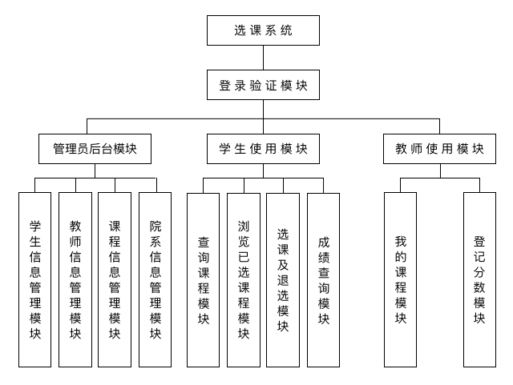

# 数据库应设计与开发实例
实例：高校在线选课系统数据库设计

系统模块如下图所示：



## 需求描述与分析(领会)
功能性需求
非功能性需求

## 系统设计(综合应用)
质量要求：
- 可靠性
- 正确性
- 兼容性
- 健壮性(容错性)

功能模块设计
数据库设计

### 确定实体
根据功能模块，看有哪些实体
```js
// 根据图自己思考的实体
学生(学生ID、姓名、学号、年级、班级、年龄、院系)
课程(课程ID、课程名称、学分、是否是公共课)
开课信息(课程ID、上课位置、上课时间、限制人数、教师ID)
院系(院系ID、院系名称)
教师(教师ID、姓名、年龄)
成绩(课程ID、学生ID、成绩)
教师课程(教师ID、课程ID)
学生选课(开课信息ID、学生ID)
```
参考答案
```js
1.学生（学号、姓名、性别、密码）
2.教师（教师工号、姓名、性别、年龄、职称、密码）
3.课程（课程号、课程名、学分、时间、地点、类别、开课学院、限选人数）
4.院系（院系名称、办公地点、教师人数）
5.系统管理员（姓名、ID号、密码）
```

### 用ER图描述局部信息结构
上述实体之间存在哪些相互联系？

1. 学生-课程
2. 教师-课程
3. 教师-院系
4. 学生-院系
5. 系统管理员-学生
6. 系统管理员-教师
7. 系统管理员-课程
8. 系统管理员-院系

E-R图


### 逻辑结构与规范化设计
如何将ER图装换为关系模式

- 学生（**学号**、姓名、性别、登录密码、院系编号）
- 院系（**院系编号**、系名、学生人数、教师人数、办公地点）
- 教师（**职工号**、姓名、性别、年龄、职称、登录密码、院系编号）
- 课程（**课程号**、课程名称、课程类别、学分、上课时间、上课地点、开课学院、限选人数、职工号）
- 系统管理员（**ID号**、姓名、登录密码）
- 选修（**学号**、课程号、成绩）
- 管理学生（管理员ID号、学号、操作时间）
- 管理院系（管理员ID号、院系编号、操作时间）
- 管理教师（管理员ID号、职工号、操作时间）
- 管理课程（管理员ID、课程号、操作时间）

数据库的实现

### 创建数据库
```bash
CREATE DATABASE db_xuanke;
```
### 创建数据表
以学生信息表为例子，把关系模式全部创建成表
```bash
CREATE TABLE student (
  StuNo INT(8) NOT NULL COMMENT '学号',
  StuName VARCHAR(10) NOT NULL COMMENT '姓名',
  StuSex CHAR(1) COMMENT '性别',
  Pwd VARCHAR(8) DEFAULT '00000000' COMMENT '登录密码',
  DeptNo INT(8) NOT NULL COMMENT '所属院系',
  PRIMARY KEY(StuNo),
  FOREIGN KEY(DeptNo) REFERENCES department(DeptNo) ON DELETE RESTRICT ON UPDATE RESTRICT
) COMMENT '学生信息表'

# 关于外键部分，可以参考: 参照完整性约束
```

- 院系编码表 deptcode
- 院系表 department
- 教师表 teacher
- 课程编码表 coursecode
- 课程表 course
- 系统管理员表 administrator
- 选修表 electing
- 管理学生表 adminstu
- 管理院系表 admindept
- 管理教师表 adminteacher
- 管理课程表 admincourse


## 系统功能实现(综合应用)
### 实现数据库行为

#### 安全控制
例子：为心来的教务管理人员金老师(用户名jin)分配具备管理学生、院系、教师和课程的权限
```bash
GRANT SELECT,UPDATE,INSERT,DELETE ON db_xuanke.* TO 'jin'@'localhost';
```
#### 管理学生
例子：金老师在学生管理功能中添加一名计算机学院的女生黄然
```bash
INSERT INTO db_xuanke.student SET StuNo=20170922, StuName='黄然', StuSex='女', Pwd=DEFAULT, DeptNo = 
SELECT DepNo FROM db_xuanke.departcode WHERE DepName='计算机学院';
```
#### 数据库保护
例子：当每位老师进行登记分数操作时，系统需要自动验证分数值是否位于0-100区间，以此保护数据库中数据的正确性
```bash
# 创建一个触发器，当分数不满足条件时直接删除
CREATE TRIGGER tri_test AFTER INSERT ON db_xuanke.electing FOR EACH ROW
BEGIN
IF NEW.Score < 0 OR NEW.Score > 100 THEN
DELETE FROM db_xuanke.electing WHERE Score=NEW.Score
END IF
END
```
#### 事务与并发控制
例子：金老师需要批量录入教师信息时，为防止其他操作对数据的影响，可以使用事务处理来维护数据库的完整性
```bash
BEGIN TRANSACTION; # 开始事务
INSERT INTO db_xuanke.teacher VALUES(10021,'万明',NULL,NULL,NULL,DEFAULT,10)
INSERT INTO db_xuanke.teacher VALUES(10022,'万明2',NULL,NULL,NULL,DEFAULT,11)
INSERT INTO db_xuanke.teacher VALUES(10023,'万明3',NULL,NULL,NULL,DEFAULT,12)
COMMIT; # 提交事务
```

#### 数据查询与统计报表
例子：为教务管理人员提供统计每个学生选修课程学分的报表
```bash
# 使用视图
CREATE VIEW v_score(StuNo,totlescore) AS 
SELECT student.StuNo,SUM(course.Credit) FORM student 
JOIN electing ON student.StuNo=electing.StuNo 
JOIN course ON course.CourseNo=electing.CorseNo
WHERE electing.Score >= 60 GROUP BY student.StuNo;
# Credit学分
```

### 应用软件的业务逻辑
首先，使用网页设计语言HTML/CSS实现系统登录验证页面

然后，通过使用服务端语言(比如php，java,node等)编写相应的服务端代码，完成登录验证页面与后台数据库的交互操作


## 系统测试与维护(综合应用)
- 登录验证功能测试
- 管理员后台主要功能测试
  - 学生信息管理系统
  - 课程信息管理系统
- 学生使用模块功能测试
- 教师使用模块功能测试

## 练习
1.在选课期间，除非遇到特殊情况，否则要保证系统正常使用，这体现了选课系统质量要求中的（  ）。单选题，答案：A
- A 可靠性
- B 正确性
- C 兼容性
- D 健壮性

2.以下属于基于教材中网络的在线选课程系统对于客户端软件、硬件环境的要求是（  ）。单选题，答案：B
- A 使用Windows作为操作系统
- B 能在支持IE的浏览器上运行
- C Apache作为Web服务器
- D MySQL作为数据库管理系统

3.以下系统功能实现中，不属于实现数据库行为的是（  ）。单选题，答案 D
- A 通过SQL语言完成与本应用功能相关的增、删、查、改等数据库操作
- B 创建子查询
- C 创建存储过程或存储函数
- D 使用php标尺语言写相应的服务端代码


