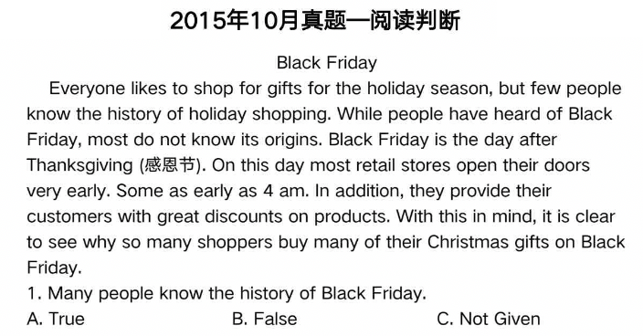
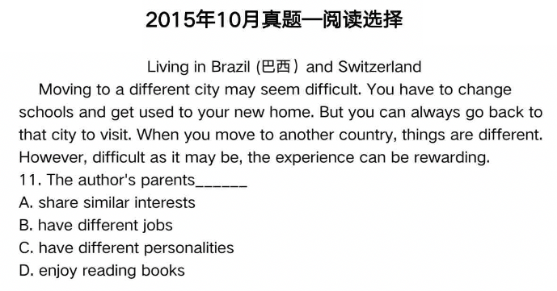
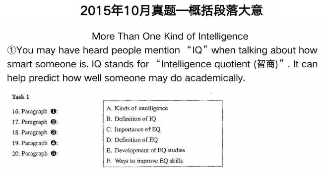
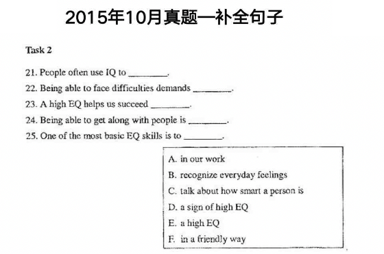
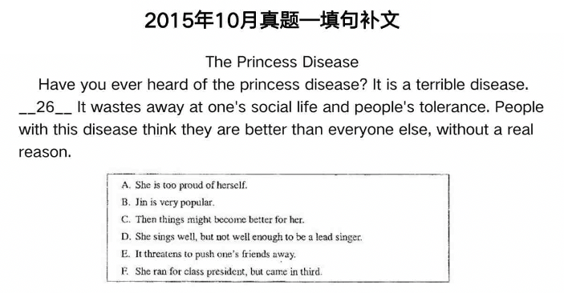
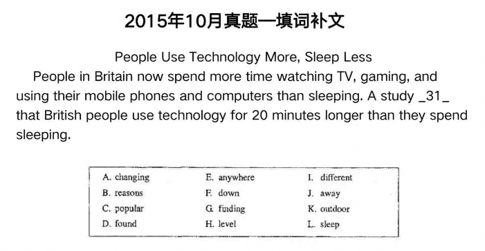
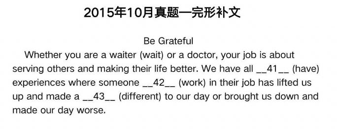
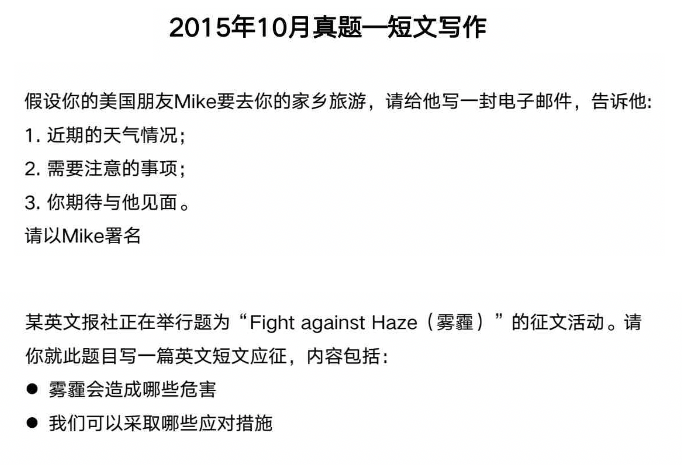
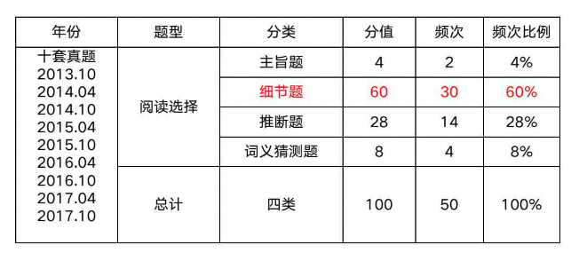
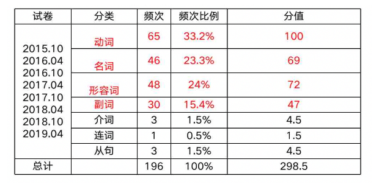

# 前言

《英语（二）》 课程代码：00015

## 为什么课程名叫英语(二)而不叫英语(一)
非英语专业考的是英语（二），英语专业考的是英语（一）

## 学习方法
1. 课上**背单词**，学语法，练题型
2. 认真听直播，跟着老师思路走
3. 课下也要认真背单词，同时理解做题思路

## 英语（二）介绍
英语（二）是高等教育自学考试各专业（英语专业除外）本科阶段的公共基础课。

大纲要求：

系统的英语语法知识和一定的词汇量（4500）

## 题型介绍
英语二没有听力

### 阅读判断
阅读文章后，根据题目判断说的是对的还是错的，或者文章里根本没有说。选择一个选项

### 阅读选择
阅读完文章后，去选择正确的选项

### 概括段落大意
在A、B、C、D、E、F中选出段落中说的是什么内容

### 补全句子
在A B C D E F中，选择用哪个选项可以补全句子，5个空，但会给6个选择

### 填句补文
一篇文章前一句和后一句给了，选择A B C D F里的一个，看哪个选项放到句子里正好合适

### 填词补文
在A - L的选项中选择一个放到段落中最合适的一个词

### 完型补文
用括号里给定词的特定形式来填空

### 短文写作
比如写信或征文

## 文章看不懂？
单词组成句子，句子组成文章

所以，先认识单词，这样句子就看懂了

句子看懂了，文章就看懂了

**单词** 最重要!!!

## 考情分析

### 考试题型及分值

类型 | 题型 | 分值 | 总计 | 考点
--- | --- | --- | --- | ---
选择题 | 阅读判断 | 10 x 1分 | 10分 | 快速阅读
选择题 | 阅读选择 | 5 x 2分 | 10分 | 深度阅读
选择题 | 概括段落大意和补全句子 | 10 x 1分 | 10分 | 概括段落大意，提取关键信息
选择题 | 填句补文 | 5 x 2分 | 10分 | 文章结构，段落连贯性
选择题 | 填词补文 | 10 x 1.5分 | 15分 | 单词认知，词性判断
非选择题 | 完型补文 | 10 x 1.5分 | 15分 | 单词认知，词性转换
非选择题 | 短文写作 | 1 x 30分 | 30分 | 100词左右

### 考情分析-阅读选择

### 考情分析-语法知识

## 课程安排
- 单词
- 语法
- 题型讲解