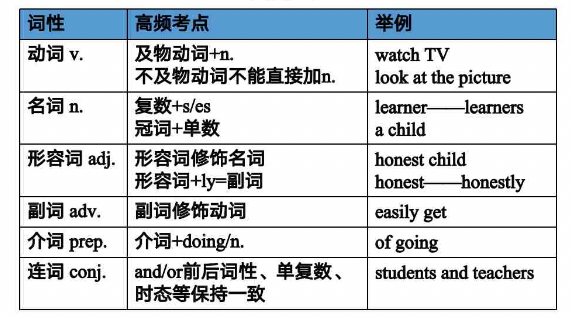

# part1

## 认识词性

英语中有8种词性  
实词 - 有实际意义的词，名动形副代
- 名词 n.  人或物，man 男人，pen 钢笔
- 动词 v. 动作, eat 吃饭, run 跑
- 形容词 adj. 用来修饰名词 good 好的，right 对的，形容词放到名词前面 good man 好人 
- 副词 adv. 用来修饰动词 realy 真正地 hopefully 有希望地 副词一般已ly结尾 
- 代词 pron.  比如 you 你

虚词 - 介冠连
- 介词 prep.  on，from等
- 冠词 art.  a，an the等
- 连词 conj. if although

## 高频词汇1
可以挖空填词，连线

词汇1
- muscle [ˈmʌsl] n. 肌肉
- college  [ˈkɒlɪdʒ]  n. 大学
- even [ˈiːvn] adv. 甚至
- while [waɪl] conj. 然而 在某某期间
- unhealthy [ʌnˈhelθi] adj. 不健康的

词汇2
- marriage [ˈmærɪdʒ] n. 婚姻
- grow [ɡrəʊ] v. 种植、成长
- plant [plɑːnt] n. 植物 v.种植
- violence [ˈvaɪələns] n. 暴力
- wine [waɪn] n. (葡萄)酒

## 语法

### 五大基本句型

- I cry.             我 哭了   主 + 谓
- I love you.        我 爱 你  主 + 谓语 + 宾语
- I give you a kiss. 我 给 你 一个吻  主 + 谓 + 宾1 + 宾2   a kiss 一个xx kiss就是名词
- You make me happy. 你 使 我 快乐    主 + 谓 + 宾 + 宾补（补充说明宾语的状态）
- You are my angel.  你 是 我 的天使  主 + 系动词 + 表语

主语、宾语的共性 一般都是名词，形容词不同做宾语

谓语 一般是动词

be动词：is、am、are 系动词，系动词后面跟的叫做 表语

句子：至少由一个名词n. + 一个动词 v.组成

### 划分句子结构
- You love me. 
- He is unhealthy.
- I know(知道).
- I bring(带来) you a bag(包).
- You let(让) me down(失望). 一般形容词放名词前面，但如果名词前面有动词，形容词需要放到名词后面

主 + 谓 + 宾，主 + 系 + 表，主 + 谓，主 + 谓 + 宾1 + 宾2(主谓双宾)， 主 + 谓 + 宾 + 宾补

## 高频词汇2

词汇3
- around [əˈraʊnd] adv. 在附近 prep. 四处
- experience [ɪkˈspɪəriəns] n.经历 v.经历
- weight [weɪt] n.重量
- fact [fækt] n.事实
- building [ˈbɪldɪŋ] n. 建筑

词汇4
- adult [əˈdʌlt] n.成年人
- resource [rɪˈsɔːs] n.资源
- mean [miːn] v.意味着 n.平均
- process [proˈsɛs] n.过程 v.处理
- dormitory [ˈdɔːmətri] n.宿舍

## 语法

### 简单句与复杂句
简单句：由一个主语和一个谓语构成的句子，只有一套主谓关系 I like apples.

**复合句：将两个或两个以上的简单语句组合成的一个句子。**

#### 并列复合句
用 and(并且), but(但是), or(或者), so(所以) conj.连词连接两个句子

句子 +  conj. + 句子

I like apples, but I don't like oranges. 我喜欢苹果，但我不喜欢橘子

#### 主从复合句
I like the apples **that** you gave me yesterday. 我喜欢你昨天给我的苹果

主句 + that + 从句

that 后面的句子 起解释说明的作用

区分 主从复合合句 和 并列复合句 的方法是看连接词是否是and,but,or,so

#### 判断复合句类型
I can sing and he can dance. 我能唱歌他能跳舞。 并列复合句

I can sing the song that he taught(教) me yesterday. 我能唱他昨天教我的歌 主从复合句

## 题型讲解
### 阅读判断题型
1分 * 10

#### 题目要求
读懂一篇 **350** 字左右短文的基础上，对给出10个句子所表达的信息作出**判断**。

#### 作答方式
- 正确的选 A (True)
- 错误的选 B (False)
- 文中没有提到的选C (Not Given)

#### 解题步骤

1. 读题干
2. 找关键词回文定位，确定题干中的关键词；回文定位
3. 比较，将关键词所在的句子与题目对比，根据True，False和Not Given特点进行判断

首要关键词
- 专有名词：人名、地点、节日等
- 数字

次要关键词
- 名词
- 形容词、副词（注意否定或肯定）
- 动词

#### 题目是原文的同义改写(True)
例子：

题目：It's **advisable** to have different lists of songs.

译文：建议你搞个不同的歌曲列表

原文：I **strongly recommend** dividing (分类) your play list into different small lists.

译文：我强烈建议你把播放列表分成不同的小列表

#### 根据原文可以绝对推出题目错误(False)

**1. 题目和原文意义不同，或直接相反（反义词，not+同义词，反义结构）**

题目：The doctor wanted to go to the railway station by taxi.

译文: 那个医生想乘坐出租车到火车站

原文：The man reached the taxi and jumped in. "The Airport, please ", he said.

译文: 那个男人走到出租车那，跳进车里。"到飞机场", 他说

**2. 题目与原文描述的范围不同，如many，sometimes，usually，mostly，all，only等**

题目：One can benefit from **all** kinds of music

译文：一个人可以从所有的音乐中受益  benefit  ['bɛnəfɪt] n.福利，效益，收益

原文：All the benefits of music can **only** be got if the listener enjoys the music he is listening to.

译文：听音乐的人只有享受听到的音乐才会从中受益

**3. 混淆理论和事实**

强调人们对某事物的一种 "理论" 或 "感觉" 时，常有 feel，consider [kənˈsɪdə(r)] 认为 及 theory。  [ˈθɪəri] 原理，理论

强调一种 "事实" 或 "已被证明" 时，常有fact（事实）及prove（证明）等词。

3.1 原文强调理论，题目强调事实。

题目：The first vertival farms **appeared 5 years ago**.

译文：第一个垂直农场出现在5年前

原文：Most experts suggest it may take about 5 to 15 years before the first vertical farms could be created.

译文：很多科学家认为在第一个垂直农场出现之前，还需要5到15年时间。

3.2 原文强调事实，题目强调理论

题目：It is still a dream for people to grow crops indoors.    [krɒp] n.农作物

译文：室内种植农作物依旧是梦想

原文：It may be difficult to believe but in fact the technology for growing crops indoors already exists.

译文：这可能很难令人相信，但室内种植农作物的技术依旧存在

#### 根据原文推不出题目(Not Given)
似对非对，not given

**1. 题目中涉及的范围小于原文涉及的范围**

题目：A **long-distance** run is good in many ways.  [ˈdɪstəns] n.距离

译文：长跑有很多好处

题目：**Running** is good for you both physically an mentally.     [ˈfɪzɪkli] adv.身体上 [ˈmentəli] adv. 心理上

译文：跑步对身体和心理都有益

**2. 主观臆断**

题目：It is hard to find a safe environment for running.

译文：一个安全的跑步场地不好找

原文：All you need is a good pair of running shoes and a safe evironment.

译文：你全部需要的就是一双好跑鞋和一个安全的场地

#### 阅读判断做题总结
1. 读题干
2. 找关键词回文定位
3. 比较

True: 题目和原文相同或是原文的**同义改写**

False: 题目和原文意思**不同，相反，混淆理论与事实**

Not Given: **似对非对** 或 **文章没给**

#### 真题

**Black Friday**

Everyone likes to shop for gifts for the holiday season, but few people konw the history of holiday shopping. 
While people have heard of Black Friday, most do not know its origin. Black Friday is the day after Thanksgiving(感恩节).
On this day most retail stores open their doors very early - some as early as 4 am.
In addition, they provide their customers with great discounts on products.
With this in mind, it is clear to see many shoppers buy many of their Christmas gifts on Black Friday.

**1. Many people know the history of Black Friday.**  
**2. Most stores open their doors for business very early on Black Friday.**  
**3. Customers get better service on Black Friday.**

A.True B.False C.Not Given

- few [fjuː] adj. 很少的；几乎没有的
- retail ['riːteɪl] n. 零售
- origin [ˈɒrɪdʒɪn] n. 起源
- mind [maɪnd] n. 理智，精神，意见
- many [ˈmeni] adj. 许多的
- in addition 另外，此外
- with sth. in mind 出于...目的

1.B few 很少，而题目是 many 很多

2.A 

3.C

**黑色星期五**

感恩节是每年11月的第四个星期四。它的第二天，是美国人大采购的第一天。在这一天，美国的商场都会推出大量的折扣和优惠活动，以在年底进行最后一次大规模的促销。因为美国的商场一般以红笔记录赤字，以黑笔记录盈利，而感恩节后的这个星期五人们疯狂的抢购使得商场利润大增，因此被商家们称为黑色星期五。

Black Friday is not as old as many people think. In fact, it is believed that the first Black Friday was held in the 1970s in the USA.
It Was a day when stores decided to mark the start of the holiday season. In order to draw more customers, they offered great discounts.
All products sold very well. This large success resulted in the name Black Friday.
It was so named because the stores were "in the black". This financial term means the stores made a lot of money.
However, it was not until around 2002 that Black Friday really started to gain in popularity.
Today in the USA, countless advertisers proudly announce their Black Friday sales. 
They hope to attract shoppers into their stores.

**4. Black Friday started in the USA.**
**5. The holiday season ends on Black Friday.**
**6. "In the black" is a financial term.**

- as old as 一样古老
- season ['si:zən] n. 时期，季节
- draw vt. 画，吸引
- resulted in 导致
- financial [faɪˈnænʃl]  adj. 金融的；财政的，财务的 商业
- term n. 术语，学期 vt. 把...叫做
- not until 直到...才
- gain [ɡeɪn] 增加，收获
- gain in popularity  [ˌpɒpjuˈlærəti] 开始流行 很受欢迎
- countless 无数的，数不尽的
- advertisers ['ædvɚ,taɪzɚ] 广告商
- proudly [ˈpraʊdli] adv. 傲慢地，自负地；得意洋洋地
- announce [əˈnaʊns] vt. 宣布；述说；预示；播报
- attract  [əˈtrækt] vt. 吸引

4.A

5.B 

6.A

